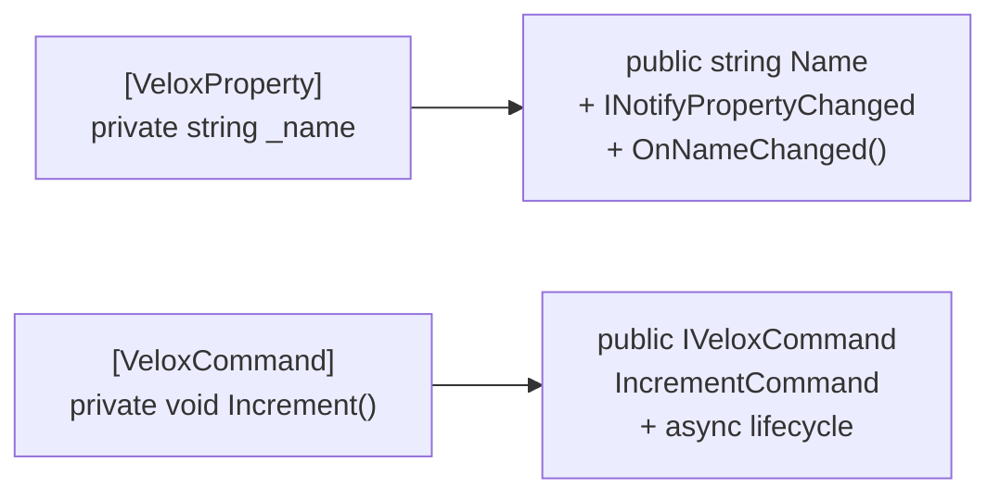

# MVVM

Two attributes (`[VeloxProperty]` + `[VeloxCommand]`) eliminate all MVVM boilerplate — no Fody, CommunityToolkit, or ReactiveUI needed.

---

## Demo

Write fields and methods; the compiler automatically generates:
- Public properties with `INotifyPropertyChanged`
- Async-capable `ICommand` wrappers

## Steps

### 1. Install

```shell
dotnet add package VeloxDev.Core
```

### 2. Write ViewModel

```csharp
using VeloxDev.MVVM;

// No base class required — just mark the class as partial.
public partial class MainViewModel
{
	// ── [VeloxProperty] fields → auto-generated notification properties ──

	[VeloxProperty] private string _name = "World";
	[VeloxProperty] private int _count;

	// Property change callback
	partial void OnCountChanged(int oldValue, int newValue)
	{
		// Manually refresh command CanExecute state if needed
	}

	// ── [VeloxCommand] methods → auto-generated ICommand properties ──

	// Default: method name Increment → property name IncrementCommand
	[VeloxCommand]
	private void Increment() => Count++;

	// Async + CanExecute validation
	// Requires implementing the corresponding partial method: CanExecute{Name}Command
	[VeloxCommand(canValidate: true)]
	private async Task SaveAsync(object? parameter)
	{
		await Task.Delay(100);
		Console.WriteLine($"Saved: {Name} with Count={Count}");
	}

	// Compiler-generated partial CanExecute method signature
	private partial bool CanExecuteSaveCommand(object? parameter)
		=> !string.IsNullOrWhiteSpace(Name);
}
```

### 3. XAML Binding

```xml
<StackPanel>
	<TextBox Text="{Binding Name}" />
	<TextBlock Text="{Binding Count}" />
	<Button Command="{Binding IncrementCommand}" Content="+" />
	<Button Command="{Binding SaveCommand}" Content="Save" />
</StackPanel>
```

## What the Generator Produces at Compile Time



| Source Code | Generated Output |
|------------|------------------|
| `[VeloxProperty] private string _name` | `public string Name { get; set; }` + **change notification** + `partial void OnNameChanged(T, T)` |
| `[VeloxCommand] private void Increment()` | `public IVeloxCommand IncrementCommand { get; }` = **`ICommand` wrapper** |

> **Key highlights**: **Zero dependencies**, **zero reflection**, **compile-time generation**.
