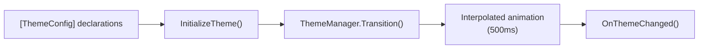

# Theme

Add dynamic Dark/Light switching with animated transitions. Requires a **GUI project** (WPF/Avalonia/WinUI).

---

## Demo

```shell
Launch → Click "Toggle Theme" → Background & text color animate smoothly in 500ms
```

## Steps

### 1. Create a WPF Project and Install

```shell
dotnet new wpf -n MyThemedApp
cd MyThemedApp
dotnet add package VeloxDev.WPF
```

### 2. Decorate Your Window with `[ThemeConfig]`

`MainWindow.xaml.cs`:

```csharp
using System.Windows;
using VeloxDev.DynamicTheme;
using VeloxDev.TransitionSystem;

// ── Theme partial ─────────────────────────────────────────
[ThemeConfig<BrushConverter, Light, Dark>(nameof(Background), ["#ffffff"], ["#1e1e1e"])]
[ThemeConfig<BrushConverter, Light, Dark>(nameof(Foreground), ["#1e1e1e"], ["#ffffff"])]
public partial class MainWindow
{
    private void LoadTheme()
    {
        InitializeTheme(); // Must be called AFTER InitializeComponent()

        // Required for animated transitions
        ThemeManager.SetPlatformInterpolator(new Interpolator());
        ThemeManager.StartModel = StartModel.Cache;
    }

    // Lifecycle callback — called automatically on every theme change
    partial void OnThemeChanged(Type? oldValue, Type? newValue)
    {
        MessageBox.Show($"Theme changed from {oldValue?.Name} to {newValue?.Name}");
    }

    private static void ReverseThemeWithAnimation()
    {
        var condition = ThemeManager.Current == typeof(Dark);
        if (condition) ThemeManager.Transition<Light>(TransitionEffects.Theme);
        else           ThemeManager.Transition<Dark>(TransitionEffects.Theme);
    }

    private static void ReverseThemeWithoutAnimation()
    {
        var condition = ThemeManager.Current == typeof(Dark);
        if (condition) ThemeManager.Jump<Light>();
        else           ThemeManager.Jump<Dark>();
    }
}

// ── UI interaction partial ───────────────────────────────
public partial class MainWindow : Window
{
    public MainWindow()
    {
        InitializeComponent();
        LoadTheme();
    }

    private void ChangeTheme(object sender, RoutedEventArgs e)
        => ReverseThemeWithAnimation();
}
```

### 3. Add Toggle Button in XAML

```xml
<Window x:Class="Demo.MainWindow" ...>
    <StackPanel>
        <TextBlock Text="Hello VeloxDev!" FontSize="24" />
        <Button Click="ReverseThemeWithAnimation" Content="Toggle Theme" />
    </StackPanel>
</Window>
```

### 4. Run

```shell
dotnet run
```

## Flow



## Why `[ThemeConfig]` Instead of ResourceDictionary?

| | VeloxDev Theme | Traditional WPF ResourceDictionary |
|--|----------------|-----------------------------------|
| Animated transitions | ✓ Built-in | ✗ Requires extra code |
| Type safety | ✓ Compile-time check | ✗ Runtime string lookup |
| Scope | ✓ Per-window / any control | ✗ Global |
| Dynamic overrides | ✓ `SetThemeValue<T>()` at runtime | ✗ Static |
