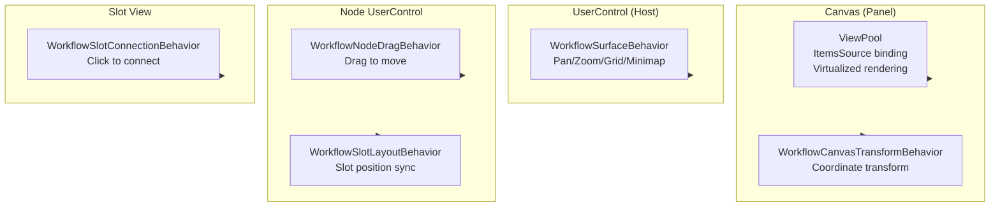

# Additional Behaviors Architecture

Attached behaviors in `VeloxDev.WorkflowSystem.AttachedBehaviors` provide interactive canvas capabilities via **WPF attached properties** (DependencyProperty). Each platform adapter ships the same behavior set.

---

## Platform Support

| Behavior | WPF | Avalonia | WinUI | MAUI | WinForms | Blazor |
|----------|:---:|:--------:|:-----:|:----:|:--------:|:------:|
| `WorkflowSurfaceBehavior` | ✅ | ✅ | ✅ | ✅ | ❌¹ | ❌ |
| `WorkflowNodeDragBehavior` | ✅ | ✅ | ✅ | ✅ | ❌¹ | ❌ |
| `WorkflowSlotConnectionBehavior` | ✅ | ✅ | ✅ | ✅ | ❌¹ | ❌ |
| `WorkflowSlotLayoutBehavior` | ✅ | ✅ | ✅ | ✅ | ❌¹ | ❌ |
| `WorkflowCanvasTransformBehavior` | ✅ | ✅ | ✅ | ✅ | ❌ | ❌ |
| `WorkflowMinimapOverlay` | ✅ | ✅ | ✅ | ✅ | ❌ | ❌ |
| `ViewPool` | ✅ | ✅ | ✅ | ✅ | ❌ | ❌ |

> ¹ WinForms uses self-drawn controls + Panel without an attached property system. Interactions are handled via direct event handlers in `WorkflowCanvas.cs`.

## Architecture



## Behavior Overview

| Behavior | Purpose | Attached To |
|----------|---------|-------------|
| `WorkflowSurfaceBehavior` | Pan, zoom, grid decorator, minimap | Host UserControl |
| `WorkflowNodeDragBehavior` | Node drag-and-drop | Node UserControl (header) |
| `WorkflowSlotConnectionBehavior` | Click slot to connect/disconnect | Slot Control |
| `WorkflowSlotLayoutBehavior` | Sync slot anchor to Canvas coordinates | Node UserControl |
| `WorkflowCanvasTransformBehavior` | Canvas transform notification (not for host) | Canvas Panel |
| `WorkflowMinimapOverlay` | Minimap overview | FrameworkElement in host |
| `ViewPool` | ItemsSource binding + pooled view rendering | Panel |

## Infrastructure Components

### ViewManager

Internal engine for `ViewPool` — manages object pooling and incremental rendering:

```csharp
public sealed class ViewManager(Panel panel)
{
    public void Attach(INotifyCollectionChanged collection);
    public void Detach();
    public void RegisterTemplate(Type viewModelType, DataTemplate template);
}
```

### ViewPool

XAML attached property:

```xml
<Canvas helpers:ViewPool.ItemsSource="{Binding Nodes}"
        helpers:ViewPool.TemplateSelector="{StaticResource WorkflowTemplateSelector}" />
```

| Property | Type | Description |
|----------|------|-------------|
| `ItemsSource` | `INotifyCollectionChanged` | ViewModel collection binding |
| `TemplateSelector` | `DataTemplateSelector` | Per-type DataTemplate selector |

### IWorkflowGridDecorator / IWorkflowMinimapOverlay

Extension interfaces called by `WorkflowSurfaceBehavior` for grid rendering and minimap.

See sub-pages for per-behavior API details.
