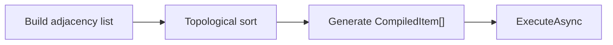

# Compilation

The `WorkflowCompiler` translates the node graph into an **ordered execution plan** — the core orchestrator of the workflow engine.

---

## Compilation Pipeline



## Compilation Dimensions (2 × 2 × 2 × 3 = 24 strategies)

| Dimension | Values | Description |
|-----------|--------|-------------|
| Mode | `BFS` / `DFS` | Breadth-first / depth-first traversal |
| Direction | `Forward` / `Reverse` | Follow outputs / follow inputs |
| Scope | `FromNode` / `Omni` | Single-subgraph / auto-discover boundaries |
| CycleHandling | `Throw` / `Trim` / `Allow` | Throw on cycle / skip revisits / preserve metadata |

```csharp
using VeloxDev.WorkflowSystem.Compilation;

var compiler = new WorkflowCompiler();
var results = compiler.Compile(startNode, CompileMode.BFS,
    CompileDirection.Forward, CompileScope.FromNode, CycleHandling.Throw);
var plan = results[0];
var finalResult = await plan.ExecuteAsync("seed");
```

## CompilationResult

| Member | Description |
|--------|-------------|
| `Items` | Ordered `CompiledItem` list in execution sequence |
| `ExecuteAsync(parameter)` | Execute the entire plan asynchronously |

## Execution Events

| Event | Parameter | When |
|-------|-----------|------|
| `ExecutionEvent.NodeStarted` | `ExecutionContext` | Before node execution |
| `ExecutionEvent.NodeCompleted` | `ExecutionContext` | After node execution |
| `ExecutionEvent.PipelineCompleted` | — | Entire pipeline done |

Register custom event receivers via `ICompileTimeSink` for logging, telemetry, and debugging.
