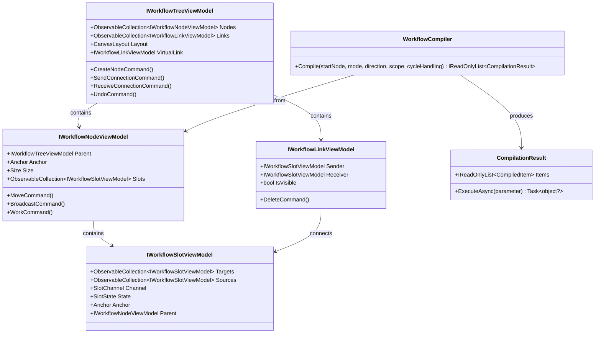
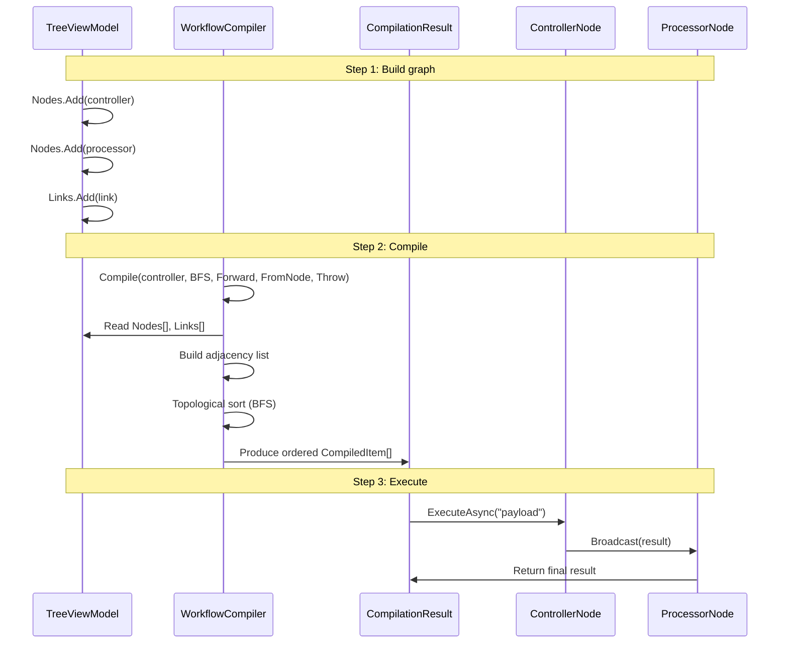

# Workflow Engine

The workflow engine is a **graph-topology-based compilation and execution system**. It models workflows as directed graphs where Nodes (vertices) are connected by Links (edges) through Slot endpoints.

---

## Software Architecture: Four-Component Model



### Component Responsibilities

| Component | Role | Key Pattern |
|-----------|------|-------------|
| **Tree** | Root container; owns all nodes, links, undo stack | Composite |
| **Node** | Executable unit; holds slots and business logic | Command |
| **Slot** | Typed connection endpoint; maintains target/source collections | Observer |
| **Link** | Visual connection between two slots | Value Object |
| **Helper** (`IWorkflow*Helper`) | Extension point for custom behaviour | Strategy |

---

## Connection Lifecycle (Sequence Diagram)

```mermaid
sequenceDiagram
    actor User
    participant Tree as TreeViewModel
    participant VSrc as Slot (Output)
    participant VDest as Slot (Input)
    participant Link as LinkViewModel

    User->>VSrc: Drag from output slot
    VSrc->>Tree: SendConnectionCommand(slot)
    Tree->>Tree: VirtualLink.Sender = slot
    User->>Tree: Move pointer
    Tree->>Tree: SetPointerCommand(anchor)
    User->>VDest: Drag over input slot
    VDest->>Tree: ReceiveConnectionCommand(slot)
    Tree->>Tree: VirtualLink.Receiver = slot
    User->>VDest: Release
    VDest->>Tree: SubmitCommand(actionPair)
    Tree->>Link: Create(Sender=VSrc, Receiver=VDest)
    Tree->>Tree: Links.Add(link)
    Tree->>Tree: UndoStack.Push(actionPair)
```

---

## Compilation & Execution (Sequence Diagram)



---

## 24 Compilation Strategies

The compiler exposes four orthogonal dimensions, yielding **2 × 2 × 2 × 3 = 24 strategies**:

| Dimension | Values | Description |
|-----------|--------|-------------|
| **Mode** | `BFS` / `DFS` | Breadth-first (level-by-level) vs depth-first |
| **Direction** | `Forward` / `Reverse` | Follow outputs vs follow inputs |
| **Scope** | `FromNode` / `Omni` | Single-subgraph vs auto-discover boundaries |
| **CycleHandling** | `Throw` / `Trim` / `Allow` | Error on cycle / skip revisits / preserve metadata |

---

## The Helper Pattern (Strategy Pattern)

Each component delegates its behaviour to a **Helper** object injected via source generator:

```
[WorkflowBuilder.Node<CustomHelper>]
public partial class MyNode : NodeViewModelBase
    ↑                          ↑
    Source generator           Base class with
    wires helper               [VeloxCommand]s
```

Helper override points:

| Helper Method | When Called | Default Behaviour |
|---------------|-------------|-------------------|
| `Install(component)` | Constructor | Wires commands, attaches event handlers |
| `WorkAsync(parameter, ct)` | During execution | No-op (override for business logic) |
| `ReceiveAsync(parameter, sender, receiver, ct)` | On incoming data | No-op |
| `BroadcastAsync(parameter, ct)` | Node signals downstream | Forwards to all output Slots |
| `CloseAsync()` | Workflow stops | Cleans up resources |
