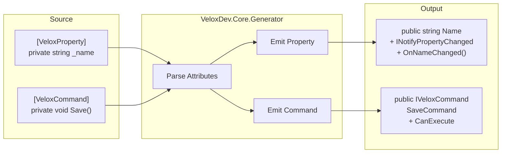

# MVVM Architecture

VeloxDev's MVVM layer is built on **Roslyn source generators**, not reflection. The generators run at compile time, producing zero-runtime-overhead notification properties and commands.

---

## Source Generator Pipeline



## VeloxProperty Generator

```mermaid
classDiagram
    class UserSource {
        [VeloxProperty]
        private string _name
    }
    class GeneratedOutput {
        +string Name {get; set;}
        +event PropertyChangedEventHandler PropertyChanged
        #void OnNameChanged(string oldValue, string newValue)
    }
    class Hook {
        partial void OnNameChanged(string old, string new)
    }
    UserSource ..> GeneratedOutput : generates
    GeneratedOutput ..> Hook : calls
```

Marks a **field** to generate:
- A public CLR property
- `INotifyPropertyChanging` / `INotifyPropertyChanged` implementations
- A `partial void On{Name}Changed(T oldValue, T newValue)` hook — override for custom logic

Supports two declaration forms:

| Form | Example |
|------|---------|
| Field | `[VeloxProperty] private string _name;` |
| Partial property | `[VeloxProperty] public partial string Name { get; set; }` |

## VeloxCommand Generator

Marks a **method** to generate an `ICommand` wrapper. The method name `Save` produces `SaveCommand`.

### Supported Method Signatures

| Signature | CanExecute | Cancellation |
|-----------|------------|-------------|
| `void Method()` | — | — |
| `void Method(object?)` | — | — |
| `Task Method()` | — | — |
| `Task Method(CancellationToken)` | — | ✓ |
| `Task Method(object?, CancellationToken)` | — | ✓ |
| With `canValidate: true` | `partial bool CanExecute{Name}Command(object?)` | — |

### Command Lifecycle Events

Every `VeloxCommand` exposes events for each stage:

```
Created → Enqueued → Dequeued → Started → Completed
                                        ↘ Failed
                                        ↘ Canceled
```

## Design Rationale

- **Zero dependencies**: No ReactiveUI, CommunityToolkit, or Fody
- **Compile-time**: No reflection, no runtime code generation
- **Partial methods**: User-extensible via `partial void On{Name}Changed` hooks
- **Concurrency control**: `semaphore` parameter limits parallel executions

### Cascade Refresh

```csharp
[VeloxProperty(cascade: [nameof(FullName)])]
private string _firstName;
// When FirstName changes, FullName's PropertyChanged is also triggered automatically
```

### Concurrency Control

```csharp
[VeloxCommand(semaphore: 1)]  // Max 1 concurrent execution
private async Task SaveAsync() { ... }
```

## Comparison: VeloxDev vs CommunityToolkit.Mvvm vs ReactiveUI

| Feature | VeloxDev | CommunityToolkit.Mvvm | ReactiveUI |
|---------|----------|----------------------|------------|
| Dependencies | Zero | Microsoft.SourceLink | Reactive* family |
| Runtime generation | None (compile-time) | None (compile-time) | None (compile-time) |
| `ICommand` impl | Built-in | Built-in | Built-in |
| Async support | Built-in | Via `AsyncRelayCommand` | Via `ReactiveCommand` |
| Cancellation token | Compile-time automatic | Manual | Manual |
| Concurrency control | Compile-time `semaphore` | Manual | Manual |
