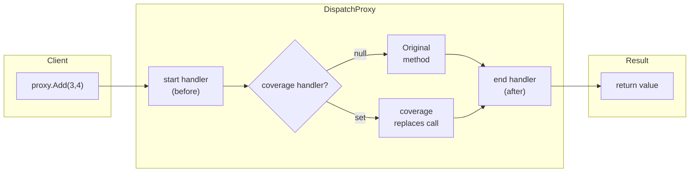

# AOP Architecture

Aspect-Oriented Programming is implemented via **`DispatchProxy`** — runtime interception without compile-time weaving.

---

## Proxy Chain Pattern

## How It Works

1. Your class implements `IAspectOriented` and marks members with `[AspectOriented]`
2. `CreateProxy<T>()` wraps the instance in a `DispatchProxy`
3. `SetProxy()` attaches three `ProxyHandler` delegates
4. `DispatchProxy.Invoke` intercepts all calls and routes through the chain

## Three Handler Slots

| Position | Delegate | Receives | Returns | Effect |
|----------|----------|----------|---------|--------|
| **start** | `ProxyHandler` | `(args, null)` | `object?` (ignored) | Logging, validation, security |
| **coverage** | `ProxyHandler` | `(args, startResult)` | `object?` | `null` = call original; non-null = replace result |
| **end** | `ProxyHandler` | `(args, result)` | `object?` (returned to caller) | Logging, metrics, audit |

## Performance Characteristics

- `DispatchProxy` uses lightweight IL emit — not reflection per call
- Handler delegates are stored in `Dictionary<string, Tuple>` — O(1) lookup
- Only `[AspectOriented]`-marked members are intercepted; unmarked members pass through at full speed
