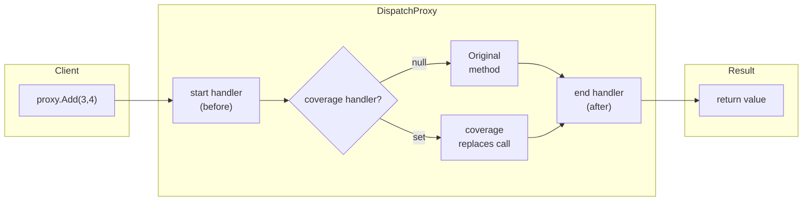

# AOP Architecture

Aspect-Oriented Programming is implemented via **`DispatchProxy`** — runtime interception without compile-time weaving.

---

## Proxy Chain Pattern



## Three Handler Slots

| Position | Delegate | Receives | Returns | Effect |
|----------|----------|----------|---------|--------|
| **start** (before) | `ProxyHandler` | `(args, null)` | `object?` (ignored) | Logging, validation, security |
| **coverage** (replace) | `ProxyHandler` | `(args, startResult)` | `object?` | `null` = call original; non-null = replace result |
| **end** (after) | `ProxyHandler` | `(args, result)` | `object?` (returned to caller) | Logging, metrics, audit |

## Complete API

### `IAspectOriented`

Marker interface — all classes needing AOP proxy must have this interface (auto-added by `[AspectOriented]` source generator).

### `[AspectOriented]`

Flags a member (method/property) for interception. Only flagged members are intercepted by `DispatchProxy`.

```csharp
[AspectOriented]
public void Reset() { ... }
```

### `target.Aop()`

Gets or creates a cached `DispatchProxy` instance. Subsequent calls return the same proxy.

```csharp
var proxy = data.Aop();  // First call creates and caches; subsequent calls reuse
```

### `SetProxy()`

```csharp
proxy.SetProxy(
    ProxyMembers.Getter,      // Getter / Setter / Method
    "MemberName",             // member name
    start: startHandler,      // before handler (optional)
    coverage: coverageHandler, // replacement handler (optional, null=run original)
    end: endHandler           // after handler (optional)
);
```

### `ProxyHandler` Delegate

```csharp
public delegate object? ProxyHandler(object?[]? parameters, object? previous);
// parameters: call arguments array
// previous: previous handler's return value (chained: start → coverage → end)
```

## Lifecycle

1. `target.Aop()` returns the cached `DispatchProxy` instance
2. Calling `proxy.Member` triggers `DispatchProxy.Invoke`
3. Handlers execute in order: **start → coverage → end**
4. When coverage returns non-null, the original method is skipped

## Use Cases

| Scenario | Recommended Handlers |
|----------|---------------------|
| Property read/write logging | Getter/Setter start or end |
| Method call logging | Method start + end |
| Authorization (block access) | start (throw to block) |
| Result caching / replacement | coverage (return cached result) |
| Change notification / audit | end |

See full example in [Examples/AOP/WPF](https://github.com/Axvser/VeloxDev/tree/master/Examples/AOP/WPF/Demo)
