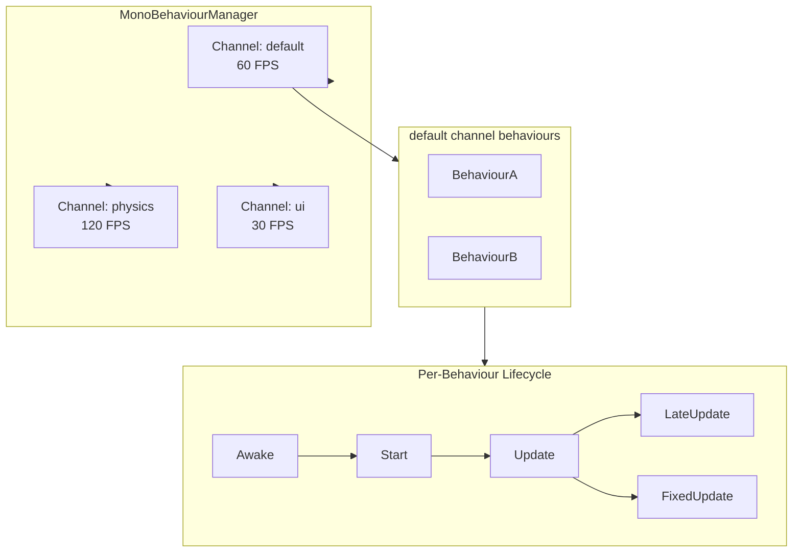
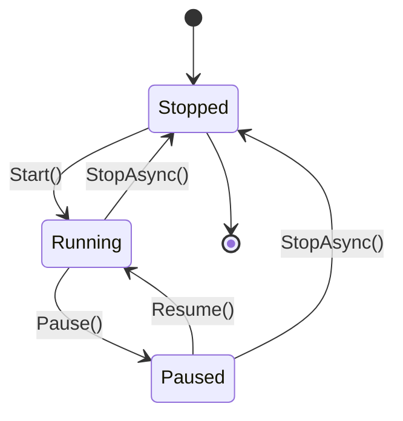

# Frame Loop Architecture

The frame loop is the heartbeat of the reactive workflow canvas, driven by **`MonoBehaviourManager`** — a Unity-inspired multi-channel lifecycle system.

---

## Multi-Channel Architecture



## Channel State Machine



## Complete API

### `[MonoBehaviour]` Attribute

```csharp
[MonoBehaviour(channel: "default", fps: -1)]
// channel: channel name (default "default")
// fps: target FPS (-1 means use channel's existing setting)
```

Generator output:

```csharp
// Generated interface implementation
public partial class MyBehaviour : IMonoBehaviour
{
    public void InitializeMonoBehaviour();
    public void CloseMonoBehaviour();

    // Partial methods for user to implement:
    partial void Awake();
    partial void Start();
    partial void Update(FrameEventArgs e);
    partial void LateUpdate(FrameEventArgs e);
    partial void FixedUpdate(FrameEventArgs e);
}
```

### MonoBehaviourManager Static API

| Method | Description |
|--------|-------------|
| `RegisterBehaviour(behaviour, channel)` | Register a behaviour to a channel |
| `UnregisterBehaviour(behaviour, channel)` | Unregister a behaviour |
| `Start(channel)` | Start the channel frame loop |
| `StopAsync(channel)` | Stop the channel |
| `Pause(channel)` | Pause the channel |
| `Resume(channel)` | Resume the channel |
| `SetTargetFPS(fps, channel)` | Change target FPS at runtime |
| `SetTimeScale(scale, channel)` | Set time scale 0–10x |
| `SetUseAsyncLoop(useAsync, channel)` | Toggle async loop mode |

## Frame Loop Internals

Each channel runs two independent loops:

| Loop | Rate | Drives | Default |
|------|------|--------|---------|
| **Update** | Configurable FPS (1–1000) | `Update()`, `LateUpdate()` | 60 FPS |
| **FixedUpdate** | Fixed interval (ms) | `FixedUpdate()` | 16 ms (~60 Hz) |

Both loops support two execution modes:

- **Thread mode**: Dedicated background thread with precision spin-wait (default)
- **Async mode**: `async/await` loop (set via `SetUseAsyncLoop(true)`)

## Complete API

### MonoBehaviourManager Static Methods

| Method | Description |
|--------|-------------|
| `RegisterBehaviour(behaviour, channel)` | Register a behaviour to a channel |
| `UnregisterBehaviour(behaviour, channel)` | Unregister a behaviour |
| `Start(channel)` | Start the channel frame loop |
| `StopAsync(channel)` | Stop the channel |
| `Pause(channel)` | Pause the channel |
| `Resume(channel)` | Resume the channel |
| `SetTargetFPS(fps, channel)` | Set target FPS |
| `SetTimeScale(scale, channel)` | Set time scale 0–10x |
| `SetUseAsyncLoop(useAsync, channel)` | Toggle async mode |

### FrameEventArgs

| Property | Type | Description |
|----------|------|-------------|
| `DeltaTime` | `TimeSpan` | Time since last frame |
| `TotalTime` | `TimeSpan` | Total channel runtime |
| `CurrentFPS` | `int` | Actual FPS |
| `TargetFPS` | `int` | Target FPS |
| `FrameCount` | `long` | Total frames since start |

## Performance Features

- **Coalescing**: Redundant invalidations within the same frame are batched
- **TimeScale**: 0–10× speed multiplier for slow-motion or fast-forward
- **Object pooling**: FrameEventArgs and config change requests are pooled to reduce GC pressure
- **Precision sleep**: Hybrid spin-wait + `Thread.Sleep(1)` for sub-millisecond accuracy
- **Channel isolation**: Each channel has its own thread, FPS, and time scale
