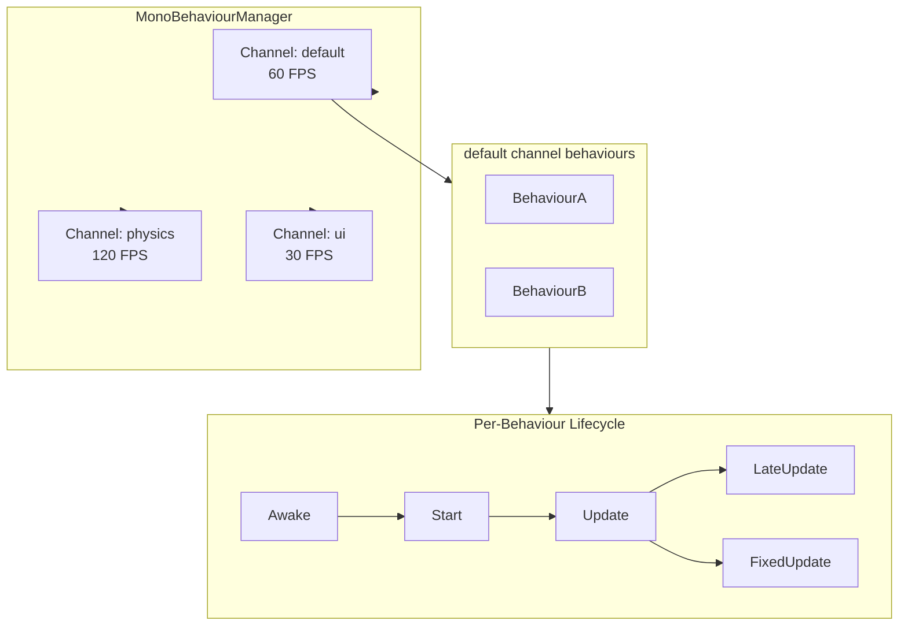
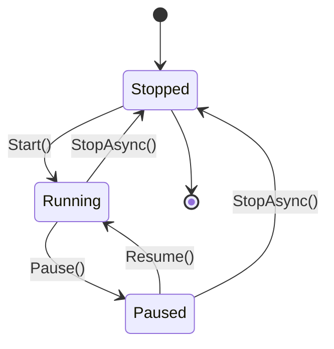

# Frame Loop Architecture

The frame loop is the heartbeat of the reactive workflow canvas, driven by **`MonoBehaviourManager`** — a Unity-inspired multi-channel lifecycle system.

---

## Multi-Channel Architecture

## Channel State Machine

## Frame Loop Internals

Each channel runs two independent loops:

| Loop | Rate | Drives | Default |
|------|------|--------|---------|
| **Update** | Configurable FPS (1–1000) | `Update()`, `LateUpdate()` | 60 FPS |
| **FixedUpdate** | Fixed interval (ms) | `FixedUpdate()` | 16 ms (~60 Hz) |

Both loops support two execution modes:

- **Thread mode**: Dedicated background thread with precision spin-wait
- **Async mode**: `async/await` loop (set via `SetUseAsyncLoop(true)`)

## Performance Features

- **Coalescing**: Redundant invalidations within the same frame are batched
- **TimeScale**: 0–10× speed multiplier for slow-motion or fast-forward
- **Object pooling**: FrameEventArgs and config change requests are pooled to reduce GC pressure
- **Precision sleep**: Hybrid spin-wait + `Thread.Sleep(1)` for sub-millisecond accuracy
