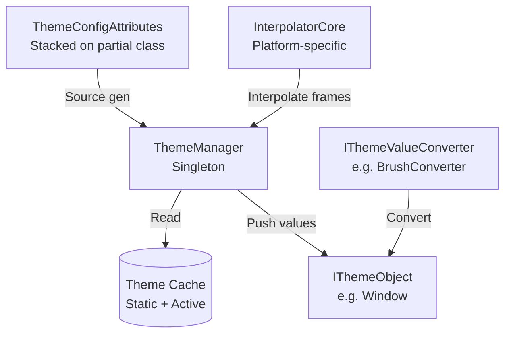

# Theme System Architecture

The theme system provides dynamic Dark/Light switching with animated transitions. It follows a **publish-subscribe** pattern: `ThemeManager` broadcasts changes to all registered `IThemeObject` instances.

---

## Architecture



## Theme Switching Process

```mermaid
sequenceDiagram
    participant App
    participant Manager as ThemeManager
    participant Cache as ThemeCache
    participant Target as IThemeObject

    App->>Manager: Transition&lt;Light&gt;(effect)
    Manager->>Manager: CancleTransition()
    Manager->>Cache: CalculateFrames(steps, ease)
    Cache-->>Manager: Queue~Action~ frames
    loop Every frame
        Manager->>Target: Apply next interpolated value
    end
    Manager->>Target: ExecuteThemeChanged(old, new)
```

## Triple Cache Architecture

| Cache | Scope | Populated By | Used When |
|-------|-------|-------------|-----------|
| **Static** (`_def_cache`) | Global per-type | `ThemeConfigAttribute` | Initial theme load |
| **Active** (`_act_cache`) | Per-instance | Runtime modifications via `SetThemeValue<T>()` | Dynamic overrides |
| **Frame** (computed) | Per-transition | `CalculateFrames()` | Animated transitions |

Lookup order: Active overrides Static; Frame overrides both during transitions.

## Platform Integration

Each platform adapter provides:
- **`Interpolator`**: Platform-specific interpolation engine (WPF, Avalonia, etc.)
- **Converters**: `BrushConverter`, `ColorConverter`, `ThicknessConverter`, `CornerRadiusConverter`, etc.
- **`TransitionEffects`**: Pre-built presets (e.g., `TransitionEffects.Theme`)

## Core Types

| Type | Role |
|------|------|
| `ThemeConfigAttribute` | Declares which properties to swap per theme (2–6 themes) |
| `ThemeManager` | Singleton; manages current theme and broadcasts changes |
| `ITheme` | Marker interface (`Dark`, `Light`, etc.) |
| `IThemeValueConverter` | Converts raw values to platform-specific types |
| `StartModel` | `Reflect` or `Cache` — determines animation start state |
