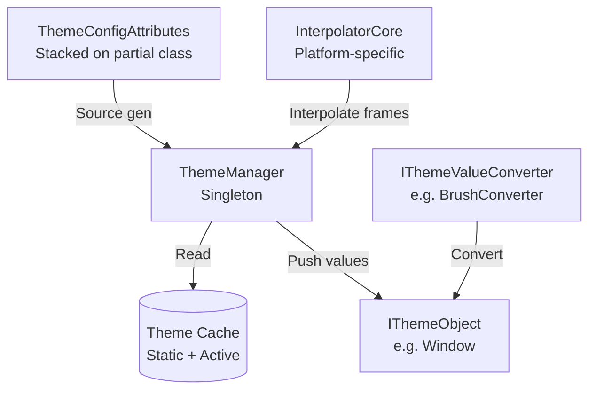
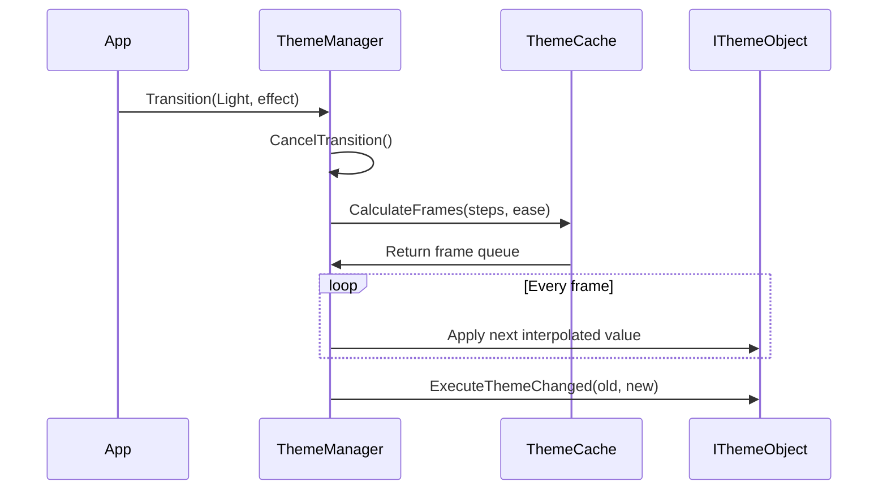

# Theme System Architecture

The theme system provides dynamic Dark/Light switching with animated transitions. It follows a **publish-subscribe** pattern: `ThemeManager` broadcasts changes to all registered `IThemeObject` instances.

---

## Architecture



## Theme Switching Process



## Triple Cache Architecture

| Cache | Scope | Populated By | Used When |
|-------|-------|-------------|-----------|
| **Static** (`_def_cache`) | Global per-type | `ThemeConfigAttribute` | Initial theme load |
| **Active** (`_act_cache`) | Per-instance | Runtime modifications via `SetThemeValue<T>()` | Dynamic overrides |
| **Frame** (computed) | Per-transition | `CalculateFrames()` | Animated transitions |

Lookup order: Active overrides Static; Frame overrides both during transitions.

## Platform Integration

Each platform adapter provides:
- **`Interpolator`**: Platform-specific interpolation engine (WPF, Avalonia, etc.)
- **Converters**: `BrushConverter`, `ColorConverter`, `ThicknessConverter`, `CornerRadiusConverter`, etc.
- **`TransitionEffects`**: Pre-built presets (e.g., `TransitionEffects.Theme`)

## ThemeManager API

| Method | Description |
|--------|-------------|
| `Jump<T>()` | Instant switch to theme T |
| `Transition<T>(TransitionEffect)` | Animated switch to theme T |
| `Transition(Type, TransitionEffect)` | Runtime type-based switch |
| `RegisterThemeObject(IThemeObject)` | Register a theme-aware object |
| `UnregisterThemeObject(IThemeObject)` | Unregister a theme-aware object |
| `SetPlatformInterpolator(Interpolator)` | Set platform interpolator (required for animation) |
| `SetThemeValue<T>(name, value)` | Runtime dynamic property override |

### Theme Declaration

```csharp
[ThemeConfig<BrushConverter, Light, Dark>(nameof(Background), ["#ffffff"], ["#1e1e1e"])]
[ThemeConfig<BrushConverter, Light, Dark>(nameof(Foreground), ["#1e1e1e"], ["#ffffff"])]
public partial class MainWindow : Window { ... }
```

### Lifecycle Hook

```csharp
// Called automatically after each theme switch
partial void OnThemeChanged(Type? oldTheme, Type? newTheme)
{
    // Custom logic
}
```

## Core Types

| Type | Role |
|------|------|
| `ThemeConfigAttribute` | Declares which properties to swap per theme (2–6 themes) |
| `ThemeManager` | Singleton; manages current theme and broadcasts changes |
| `ITheme` | Marker interface (`Dark`, `Light`, etc.) |
| `IThemeValueConverter` | Converts raw values to platform-specific types |
| `StartModel` | `Reflect` or `Cache` — determines animation start state |
