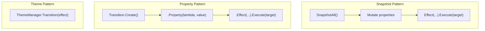
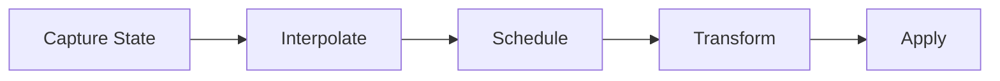

# Animation Architecture

The animation system is built on **state-snapshot interpolation**. Every animation captures property values at a point in time, then interpolates them toward target values using easing curves.

---

## Three Animation Patterns

## Interpolation Pipeline

### Component Breakdown

| Layer | Class | Responsibility |
|-------|-------|---------------|
| **State** | `StateSnapshot`, `IFrameState` | Captures property values at a point in time |
| **Interpolation** | `InterpolatorCore`, 14+ `NativeInterpolators` | Computes intermediate values for `double`, `Point`, `Color`, `Thickness`, `Vector2/3/4`, `Quaternion`, etc. |
| **Scheduling** | `TransitionSchedulerCore` | Manages per-target animation queues; supports mutual exclusion |
| **Interpretation** | `TransitionInterpreterCore` | Applies computed frames to the target object on the UI thread |
| **Easing** | `Eases` (8 families × 3 modes = 24 easing curves) | Transforms linear time to curved time |

## Easing Function Families

| Family | Characteristic |
|--------|---------------|
| `Sine` | Smooth sinusoidal acceleration |
| `Quad` / `Cubic` / `Quart` / `Quint` | Polynomial acceleration (power 2–5) |
| `Expo` | Exponential acceleration |
| `Circ` | Circular arc acceleration |
| `Back` | Overshoots then settles |
| `Elastic` | Oscillating rubber-band effect |
| `Bounce` | Simulates bouncing |

## Native Interpolators

| Type | Interpolator |
|------|-------------|
| `double` | `DoubleInterpolator` |
| `float` | `FloatInterpolator` |
| `int` | `IntInterpolator` |
| `long` | `LongInterpolator` |
| `Point` | `PointInterpolator` |
| `Size` | `SizeInterpolator` |
| `Color` | `ColorInterpolator` |
| `Vector2/3/4` | `Vector*Interpolator` |
| `Quaternion` | `QuaternionInterpolator` |
| `Rectangle` / `RectangleF` | `Rectangle*Interpolator` |
| `Anchor` (custom) | `Anchor.Interpolate()` |
