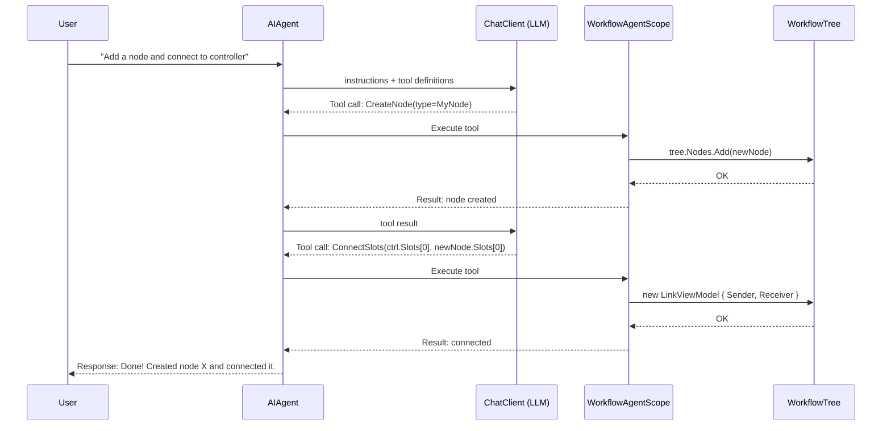
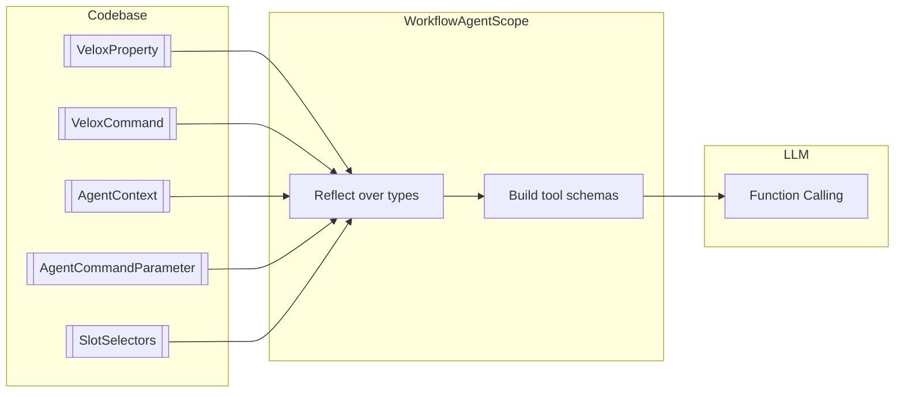

# Intelligent Agent Architecture

The agent system is built on the **MAF (Model-Aware Function) framework** — it translates workflow component metadata into LLM-understandable tool definitions, enabling natural-language-driven graph manipulation. MAF has two layers: **Core** (attribute annotations, command discovery, type resolution) and **Extension** (`WorkflowAgentScope`, embedded resources, MCP integration).

---

## Tool Call Flow



## MAF Tool Generation Pipeline



## AI Attribute Reference

All attributes defined in `VeloxDev.Core` (no Extension dependency).

| Attribute | Target | Purpose | Multilingual |
|-----------|--------|---------|-------------|
| `[AgentContext(lang, desc)]` | Class/property/method/field | Human-readable description for the LLM | ✅ 33 languages |
| `[AgentCommandParameter]` | Property/method/field | Declare command parameter type | ❌ |
| `[AgentCommandParameter(typeof(T))]` | Same | Declare concrete .NET parameter type | ❌ |
| `[SlotSelectors(typeof(Enum))]` | SlotEnumerator property | Declare allowed enum selector types | ❌ |

### `[AgentContext]` Details

Allows multiple annotations (`AllowMultiple = true`), supporting multilingual descriptions simultaneously.

```csharp
[AgentContext(AgentLanguages.English, "NetworkFlow relay node.")]
[AgentContext(AgentLanguages.Chinese, "NetworkFlow 中转节点")]
[WorkflowBuilder.Node<HttpHelper<NodeViewModel>>(workSemaphore: 5)]
public partial class NodeViewModel { ... }
```

### `[AgentCommandParameter]` Details

```csharp
[AgentCommandParameter(typeof(string))]  // Requires string parameter
[VeloxCommand]
private async Task SetUrl(object? parameter, CancellationToken ct) { ... }

[AgentCommandParameter]  // No parameter
[VeloxCommand]
private async Task Process(CancellationToken ct) { ... }
```

### `[SlotSelectors]` Details

For `SlotEnumerator<TSlot>` properties only.

```csharp
[SlotSelectors(typeof(MyEnum))]
[VeloxProperty] public partial SlotEnumerator<SlotViewModel> OutputSlots { get; set; }
```

## WorkflowAgentScope Configuration

Defined in `VeloxDev.Core.Extension`, created via `tree.AsAgentScope()`.

```csharp
var scope = tree.AsAgentScope()

    // ── Basic ──────────────────────────────────
    .WithPromptLanguage(AgentLanguages.English)   // Prompt language (default English)
    .WithAutoDiscovery("VeloxDev.Core")           // Auto-scan assembly
    .WithMaxToolCalls(200)                        // Max tool call rounds (default 50)

    // ── Custom type registration ──────────────
    .WithComponents(typeof(MyNode))               // Register custom node types
    .WithInterfaces(typeof(IMyService))           // Register custom interfaces
    .WithEnums(typeof(MyEnum))                    // Register custom enums
    .WithData(typeof(MyDto))                      // Register custom DTOs

    // ── Safety & state ────────────────────────
    .WithConfirmationLevel(ConfirmationLevel.Level1)  // Safety level
    .WithAutoMarkDirty(true);                         // Auto mark modified
```

### Safety Levels

| Level | Behavior |
|-------|----------|
| `Level0` Auto | All mutations allowed |
| `Level1` Caution | Destructive ops need confirmation (recommended) |
| `Level2` Confirm | All mutations need confirmation |
| `Level3` Strict | Read-only by default, each mutation requires explicit approval |

### Tool Providers

| Method | Returns | Description |
|--------|---------|-------------|
| `ProvideTools()` | `AITool[]` | Tool definitions for LLM |
| `ProvideProgressiveContextPrompt()` | `string` | Topology description |
| `ExecuteToolAsync(name, args)` | `Task<string>` | Execute a named tool |

### Tool Call Events

```csharp
scope.ToolCalled += (sender, e) =>
{
    Console.WriteLine($"Tool: {e.ToolName}, Args: {string.Join(", ", e.Arguments)}");
};
```

## AgentCommandDiscoverer

Generic command discovery — works on any object without Scope dependency.

```csharp
var commands = AgentCommandDiscoverer.DiscoverCommands(
    myViewModel, AgentLanguages.English);

foreach (var cmd in commands)
    Console.WriteLine($"Command: {cmd.Name}, ParamType: {cmd.ParameterType?.Name ?? "none"}, CanExecute: {cmd.CanExecute}");

var result = await AgentCommandDiscoverer.ExecuteAsync(
    myViewModel, commands[0], "parameter");
```

| CommandDescriptor | Description |
|-------------------|-------------|
| `Name` | Command property name |
| `ParameterType` | Type from `[AgentCommandParameter]` |
| `AgentDescriptions` | `[AgentContext]` descriptions |
| `CanExecute` | Whether currently executable |

## Confirmation Events

```csharp
((IAgentConfirmationNotifier)scope).ConfirmationRequested += (sender, e) =>
{
    Console.WriteLine($"Confirmation: {e.Description}");
    e.Result = AgentConfirmationResult.AllowOnce;
};
```

| `AgentConfirmationResult` | Behavior |
|--------------------------|----------|
| `AllowOnce` | Allow this time only |
| `AllowAlways` | Remember (by `OperationKey`) |
| `Deny` | Deny |

## Agent Tools

Agent tools are provided by `WorkflowAgentToolkit`, organized into six layers from low-level queries to high-level operations.

### Layer 1: Query Tools

| Tool | Description |
|------|-------------|
| `ListNodes` | List all nodes in the workflow |
| `GetNodeDetail` | Get details of a specific node |
| `GetNodeDetailById` | Get node by RuntimeId |
| `ListConnections` | List all connections |
| `GetTypeSchema` | Get JSON Schema for a .NET type |

### Layer 2: Progressive Context & Snapshots

| Tool | Description |
|------|-------------|
| `GetWorkflowSummary` | Get workflow summary |
| `GetComponentContext` | Get component capabilities |
| `ListComponentCommands` | List executable commands |
| `TakeSnapshot` | Record a state snapshot |
| `GetChangesSinceSnapshot` | Diff against snapshot |
| `MarkDirty` | Mark workflow as modified |

### Layer 3: Node & Slot Mutations

| Tool | Description |
|------|-------------|
| `CreateNode` | Create and configure a node |
| `CreateAndConfigureNode` | Create node with initial properties |
| `DeleteNode` | Delete a node |
| `MoveNode` | Move a node |
| `SetNodePosition` | Set precise position |
| `ResizeNode` | Resize a node |
| `CreateSlotOnNode` | Create a new Slot on a node |
| `DeleteSlot` | Delete a Slot |
| `PatchNodeProperties` | Batch modify node properties |
| `PatchComponentById` | Modify any component by RuntimeId |

### Layer 4: Connection Management

| Tool | Description |
|------|-------------|
| `ConnectSlots` | Connect two Slots |
| `ConnectSlotsById` | Connect by RuntimeId |
| `DisconnectSlots` | Disconnect two Slots |
| `DisconnectSlotsById` | Disconnect by RuntimeId |
| `DisconnectAllFromSlot` | Disconnect all from a Slot |

### Layer 5: Execution & Graph Traversal

| Tool | Description |
|------|-------------|
| `ExecuteWork` | Trigger WorkCommand on a node |
| `BroadcastNode` | Trigger BroadcastCommand |
| `ReverseBroadcastNode` | Trigger ReverseBroadcastCommand |
| `ExecuteCommandOnNode` | Execute any command on a node |
| `ExecuteCommandById` | Execute command by RuntimeId |
| `SearchForward` | Traverse graph forward |
| `SearchReverse` | Traverse graph backward |
| `SearchAllRelative` | Find all related nodes |
| `FindPath` | Find path between two nodes |
| `IsConnected` | Check if two nodes are connected |
| `FindNodes` | Search nodes by criteria |
| `ResolveSlotId` | Resolve a Slot RuntimeId |
| `CloneNodes` | Clone a set of nodes |
| `BatchExecute` | Execute multiple operations |

### Layer 6: Conditional Slot Collection

| Tool | Description |
|------|-------------|
| `ListSlotProperties` | List SlotEnumerator properties |
| `AddSlotToCollection` | Add entry to conditional slot collection |
| `RemoveSlotFromCollection` | Remove entry from collection |
| `SetEnumSlotCollection` | Bulk-populate slots from an enum |
| `GetEnumSlotByValue` | Get slot by enum value |
| `SetEnumSlotChannel` | Set conditional slot channel |
| `ConnectEnumSlot` | Connect a conditional slot |

### Undo/Redo

| Tool | Description |
|------|-------------|
| `Undo` | Undo last operation |
| `Redo` | Redo last undone operation |

All tools are wrapped with `TrackedAIFunction` — each invocation automatically fires the `ToolCalled` event.

## Full Call Chain

```
User natural language
  → AIAgent (AITool invocation)
    → WorkflowAgentScope.ExecuteToolAsync()
      → WorkflowAgentToolkit
        → ComponentPatcher (modify nodes/properties)
        → CommandInvoker (execute commands)
        → TypeIntrospector (query type info)
    → Result back to LLM
  → Natural language response to user
```

Full example: [Examples/Workflow/Common/Lib/](https://github.com/Axvser/VeloxDev/tree/master/Examples/Workflow/Common/Lib/)
