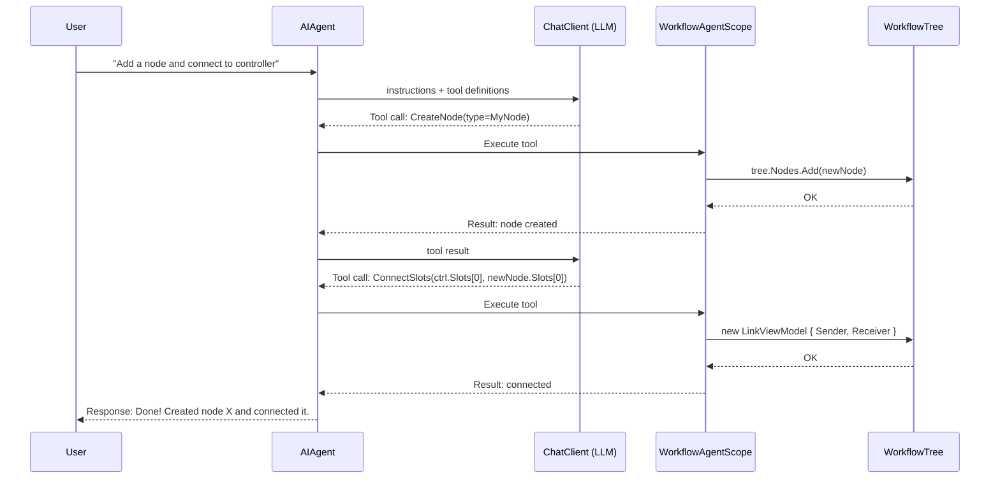
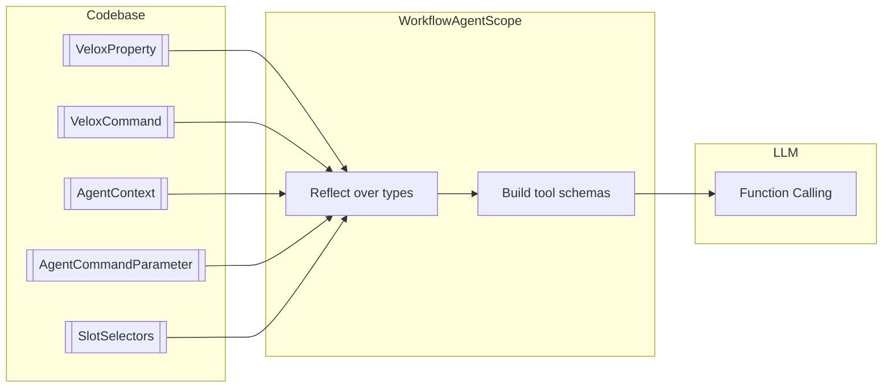
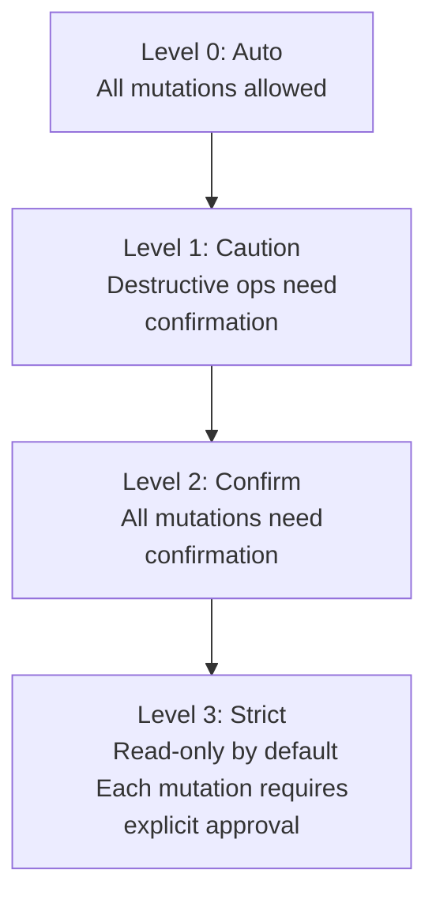

# Intelligent Agent Architecture

The agent system is built on the **MAF (Model-Aware Function) framework** — it translates workflow component metadata into LLM-understandable tool definitions, enabling natural-language-driven graph manipulation.

---

## Tool Call Flow

## MAF Tool Generation Pipeline

## Safety Levels

## Context Awareness

| Feature | Mechanism |
|---------|-----------|
| **Progressive Context** | `ProvideProgressiveContextPrompt()` generates a text description of the current graph topology |
| **Auto-discovery** | `WithAutoDiscovery(assembly)` scans for `[AgentContext]`, `[AgentCommandParameter]`, `[SlotSelectors]` |
| **Custom registration** | `WithComponents(types)`, `WithData(types)`, `WithEnums(types)` for domain-specific types |
| **MCP support** | `McpServerConfiguration` for connecting to external data sources |
