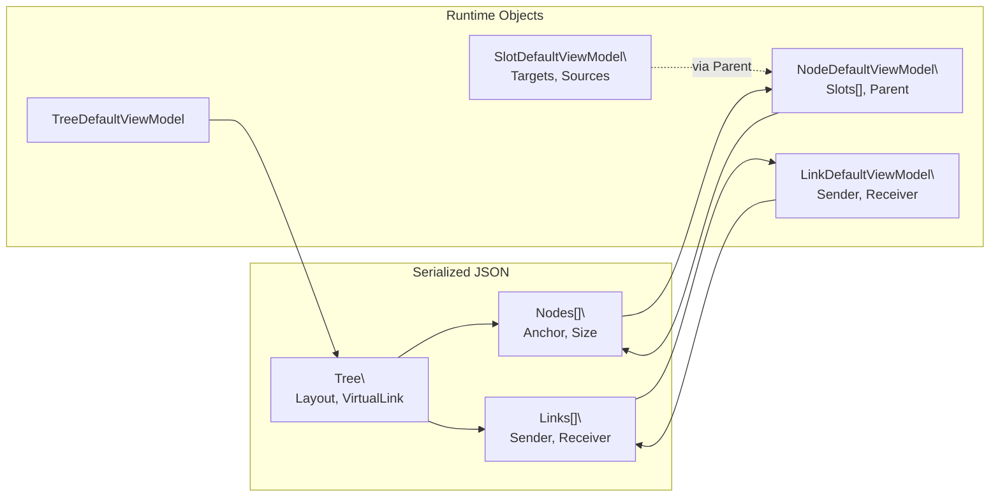
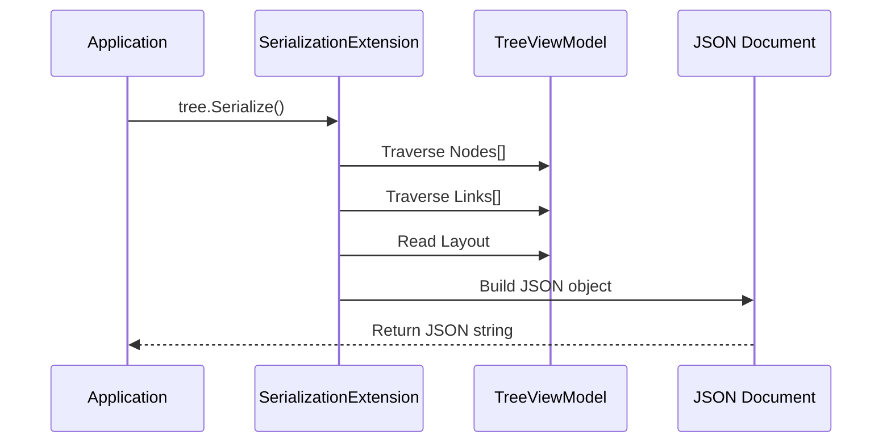

# Persistence Architecture

Workflow state serialization using `Newtonsoft.Json` via extension methods in `VeloxDev.Core.Extension`. The serializer understands the full component graph — Tree, Nodes, Slots, Links, and their `[VeloxProperty]` values.

---

## Serialization Graph



## Extension Method API Surface

| Method | Description |
|--------|-------------|
| `tree.Serialize()` | Serialize to JSON string |
| `tree.Serialize(options)` | Serialize with options |
| `json.Deserialize<T>()` | Deserialize (throws on failure) |
| `json.TryDeserialize<T>(out var)` | Safe deserialization |
| `await tree.SerializeAsync()` | Async serialization |
| `await json.DeserializeAsync<T>()` | Async deserialization |
| `tree.SerializeToUtf8Bytes()` | Serialize to UTF8 bytes |
| `stream.SerializeToStreamAsync()` | Serialize to stream |

## SerializationOptions Fluent API

```csharp
var json = tree.Serialize(
    SerializationOptions.Create()
        .WithIndented()                    // Human-readable
        .WithTypeNameHandling(TypeNameHandling.Auto)  // Polymorphic types
        .WithNullValueHandling(NullValueHandling.Ignore)
        .WithDefaultValueHandling(DefaultValueHandling.Ignore)
);
```

## What Gets Serialized

| Component | Properties |
|-----------|-----------|
| **Tree** | Layout (canvas size, viewport offset), VirtualLink |
| **Node** | Anchor (x, y, layer), Size, all `[VeloxProperty]` fields |
| **Slot** | Anchor, Channel, State, Targets (as slot IDs), Sources (as slot IDs) |
| **Link** | Sender (slot ID), Receiver (slot ID), IsVisible |
| **Custom data** | All `[VeloxProperty]` values, including business-specific data |

## Full Extension Method API

| Category | Method | Description |
|----------|--------|-------------|
| Sync | `tree.Serialize()` | Serialize to JSON string |
| Sync | `json.Deserialize<T>()` | Deserialize (throws on failure) |
| Sync | `json.TryDeserialize<T>(out var)` | Safe deserialization |
| Async | `await tree.SerializeAsync()` | Async serialization |
| Async | `await json.DeserializeAsync<T>()` | Async deserialization |
| Formatting | `new SerializationOptions().WithIndented()` | Indented output |
| Bytes | `tree.SerializeToUtf8Bytes()` | Serialize to UTF8 bytes |
| Stream | `tree.SerializeToStreamAsync(stream)` | Serialize to stream |

## Serialization Flow



## Cross-Platform

The same serialized JSON can be loaded on **Desktop**, **Browser**, or **Mobile** — enabling cloud-backed workflow persistence. The serialization is agnostic of the GUI framework; only runtime object structure matters.
