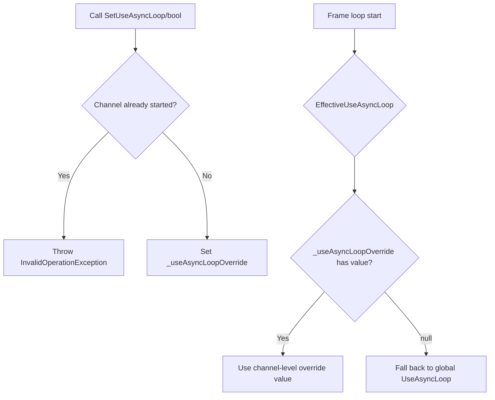

# Channel-level AsyncLoop Override Mechanism **Involved file:** `Src/Core/VeloxDev.Core/TimeLine/MonoBehaviourManager.cs`
> **Change amount:** +49 / -3 lines

---

## Background

Previously, `MonoBehaviourManager` had only one global static property `UseAsyncLoop` controlling the frame loop mode of **all channels**. If you need to use async/await for a specific channel while other channels continue to use native Thread, it is impossible.

## Improved Design

Introduce a **per-channel independent override** mechanism, add a nullable field as the override value, and fall back to the global setting when it is `null`.

### New Fields

```csharp
private bool? _useAsyncLoopOverride;
```

### Add Computed Property

```csharp
private bool EffectiveUseAsyncLoop => _useAsyncLoopOverride ?? MonoBehaviourManager.UseAsyncLoop;
```

The judgment of all frame loop starting points has been changed from `MonoBehaviourManager.UseAsyncLoop` to `EffectiveUseAsyncLoop`.

### Instance Methods (Channel Level)

```csharp
/// <summary>
/// Sets whether the current channel uses async/await instead of the native Thread-driven frame loop.
/// </summary>
/// <exception cref="InvalidOperationException">Throws an exception when called if the channel has already started.</exception>
public void SetUseAsyncLoop(bool useAsyncLoop);

/// <summary>
/// Clears the independent override configuration for the current channel, falling back to the global UseAsyncLoop.
/// </summary>
/// <exception cref="InvalidOperationException">Throws an exception when called if the channel has already started.</exception>
public void ClearUseAsyncLoopOverride();
```

### Static API (delegate to channel)

```csharp
// Set by channel name
public static void SetUseAsyncLoop(bool useAsyncLoop, string channel = DEFAULT_CHANNEL);

// Clear by channel name
public static void ClearUseAsyncLoopOverride(string channel = DEFAULT_CHANNEL);
```

---

## Call Flow



---

## Design Points

- **Channel Isolation**: Each `Channel` instance independently maintains its own `_useAsyncLoopOverride`
- **Safety Guard**: During channel operation, modifying the override value is prohibited, preventing switching of drive mode mid-frame cycle.
- **Transparent fallback**: `null` means 'not covered', automatically uses the global `UseAsyncLoop`
- **Modifiable after stopping**: After the channel stops, you can freely modify the override value; it takes effect upon restart.

---

## Related Tests

Add complete unit test coverage:

| Test Category               | Test Case                                                                                                                                          | Description                                                          |
| ------------------------- | ------------------------------------------------------------------------------------------------------------------------------------------------- | -------------------------------------------------------------------- |
| SetUseAsyncLoop           | [View test details](https://github.com/Axvser/VeloxDev/blob/master/Src/Core/VeloxDev.Core.Test/TimeLine/MonoBehaviourManagerTests.cs)               | Override settings before start, after start, and after stop          |
| ClearUseAsyncLoopOverride | Same as above                                                                                                                                     | Various scenarios for clearing override                             |
| Channel isolation         | Same as above                                                                                                                                     | Different channels do not affect each other                         | Test file: `Src/Core/VeloxDev.Core.Test/TimeLine/MonoBehaviourManagerTests.cs` (new, untracked)

---

## Rollback Guide

If you want to keep the global behavior of v5.4.0, no changes are needed—all channels default to fall back to `MonoBehaviourManager.UseAsyncLoop`.