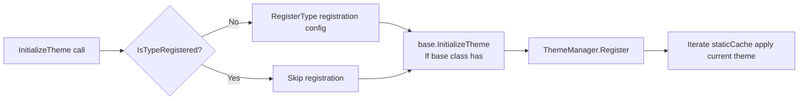

# Theme System ThemeCache Refactoring

> **Related files:** - `Src/Generators/VeloxDev.Core.Generator/Theme.cs`（+170 / -171，major rewrite） - `Src/Core/VeloxDev.Core/DynamicTheme/ThemeCache.cs`（**New**）
>   **Change amount:** +170 / -171 lines

---

## Background

Previously, every class with `[ThemeConfig]` generated a large number of static dictionary fields:

```
__velox__Converters__         — Converter instance dictionary
__velox_Theme__Props__        — Property name → PropertyInfo dictionary
__velox__Def__ThemeCache__    — Three-level nested dictionary (property name → PropertyInfo → theme type → value)
__velox__Act__ThemeCache__    — Instance-level activity override dictionary
```

This results in:

- Generate a large amount of repetitive static field code per topic class.
- Does not support inheritance chain property merging
- Method cannot be overridden (`public` non-`virtual`)

## Improve Design

Delegate all theme data uniformly to the `ThemeCache` centralized cache class, and the generated class only contains method implementations.

### ThemeCache Class Design

**Namespace:** `VeloxDev.DynamicTheme`

| Component             | Description                                                                      |
| ---------------- | ------------------------------------------------------------------------- |
| `_staticCache` | `Dictionary<Type, Dictionary<string, PropertyEntry>>` — Type-level static configuration |
| `_activeCache` | `ConditionalWeakTable<IThemeObject, InstanceCache>` — Instance-level active overrides |
| `_converters`  | `Dictionary<string, IThemeValueConverter>` — Global converter instance pool |

**Core API:**

```csharp
public static class ThemeCache
{
    // Type registration
    public static bool IsTypeRegistered(Type type);
    public static void RegisterType(Type type, Dictionary<string, (...)>> properties);

    // Static cache query (inheritance chain merge)
    public static Dictionary<string, ...> GetStaticForType(Type type);

    // Instance-level active cache
    public static InstanceCache GetOrCreateActiveEntry(IThemeObject instance);
    public static InstanceCache? TryGetActiveEntry(IThemeObject instance);
    public static void RemoveActiveEntry(IThemeObject instance);

    // Default value lookup (inheritance chain traversal)
    public static bool TryGetDefaultValue(Type type, string propertyName, Type themeType, out object? value);
}
```

### Inheritance Chain Support

`GetStaticForType(Type)` Merges properties by recursively traversing base classes:

```mermaid
flowchart TD
    A[GetStaticForType(DerivedClass)] --> B[递归 CollectStaticForType]
    B --> C[先处理 BaseType]
    C --> D[再处理 DerivedClass]
    D --> E[派生类属性覆盖基类同名属性]
    E --> F[返回合并后字典]
```

### Method Overridability

| Condition                                         | Generated Method Modifier       |
| ------------------------------------------------ | ------------------------------- |
| Class is `sealed`                                | `public`（无修饰符）          |
| Base class already has `[ThemeConfig]`（即生成器处理过） | `public override`               |
| Base class does not have `[ThemeConfig]` or no base class | `public virtual`                |

### Lazy registration



---

## Converter Processing Changes

| Aspect       | v5.4.0                             | v5.5.1                                            |
| ---------- | ---------------------------------- | ------------------------------------------------- |
| Converter instance | Generates a `static readonly` field per class | Uses inline `Activator.CreateInstance` per call |
| Registration method | Created in static initializer | Can be globally registered via `ThemeCache.RegisterConverter()` |

---

## Generator Code Quality Improvement

- Introduce auxiliary variables such as `classFullTypeName`, `methodModifier`, `baseCallInit` for unified handling.
- Configuration collection no longer uses complex nested loops, instead using the `configRegistrations` list
- `UpdatePropertyToCurrentTheme` simplified from 30+ lines to about 15 lines

---

## Backward Compatibility

All public API signatures remain unchanged:

- `SetThemeValue<T>(string, object?)`
- `RestoreThemeValue<T>(string)`
- `GetStaticThemeCache()` / `GetActiveThemeCache()`
- `UpdatePropertyToCurrentTheme(string)`
- `UpdateAllPropertiesToCurrentTheme()`
- `InitializeTheme()`
- `ExecuteThemeChanging(Type?, Type?)` / `ExecuteThemeChanged(Type?, Type?)`

But the behavior has subtle changes (see [API Usage Difference Comparison](../06-API使用差异对照/index.md)).