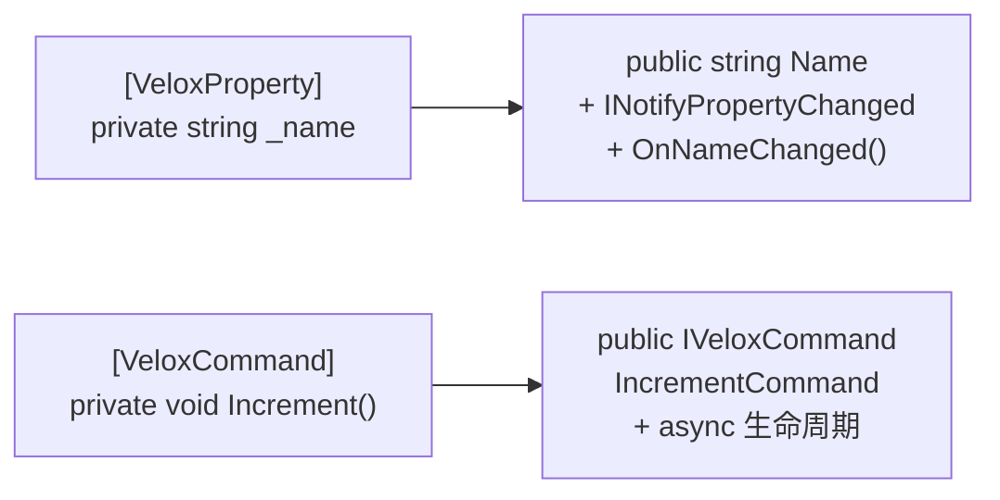

# MVVM

两个特性（`[VeloxProperty]` + `[VeloxCommand]`）消除所有 MVVM 样板代码 —— 无需 Fody、CommunityToolkit 或 ReactiveUI。

---

## Demo 效果

编写类字段和方法，编译后自动生成：
- 带 `INotifyPropertyChanged` 的公开属性
- 带异步支持的 `ICommand` 属性

## 操作步骤

### 1. 安装

```shell
dotnet add package VeloxDev.Core
```

### 2. 编写 ViewModel

```csharp
using VeloxDev.MVVM;

// 不需要继承任何 MVVM 基类，标记 partial class 即可
// 如果项目已在使用其他 MVVM 框架，可以继承其 ObservableObject，
// 但不要在两个框架之间共享继承链，以免冲突
public partial class MainViewModel
{
    // ── [VeloxProperty] 字段 → 自动生成通知属性 ──────────────

    [VeloxProperty] private string _name = "世界";
    [VeloxProperty] private int _count;

    // 属性变更回调：Index 变化时通知 MinusCommand 刷新可执行性
    partial void OnCountChanged(int oldValue, int newValue)
    {
        // 手动刷新命令 CanExecute 状态
    }

    // ── [VeloxCommand] 方法 → 自动生成 ICommand 属性 ──────────

    // 默认配置：方法名 Increment → 属性名 IncrementCommand
    [VeloxCommand]
    private void Increment() => Count++;

    // 异步 + 可执行性验证
    // 必须实现对应的 partial 方法: CanExecute{Name}Command
    [VeloxCommand(canValidate: true)]
    private async Task SaveAsync(object? parameter)
    {
        await Task.Delay(100);
        Console.WriteLine($"已保存：{Name}，Count={Count}");
    }

    // 编译器生成的 partial CanExecute 方法签名
    private partial bool CanExecuteSaveCommand(object? parameter)
        => !string.IsNullOrWhiteSpace(Name);
}
```

### 3. XAML 绑定

```xml
<StackPanel>
    <TextBox Text="{Binding Name}" />
    <TextBlock Text="{Binding Count}" />
    <Button Command="{Binding IncrementCommand}" Content="+" />
    <Button Command="{Binding SaveCommand}" Content="保存" />
</StackPanel>
```

## 生成器在编译期做了啥？



| 源写法 | 编译后生成 |
|--------|-----------|
| `[VeloxProperty] private string _name` | `public string Name { get; set; }` + **属性变更通知** + `partial void OnNameChanged(T, T)` |
| `[VeloxCommand] private void Increment()` | `public IVeloxCommand IncrementCommand { get; }` = **`ICommand` 包装器** |

> 核心亮点：**零依赖**、**零反射**、**编译时生成**。
