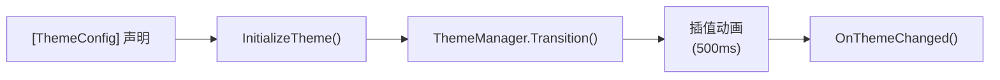

# 主题

为应用一键添加深色/浅色动态主题切换，支持**动画过渡**。需要 **GUI 项目**（WPF/Avalonia/WinUI）。

---

## Demo 效果

```shell
启动 → 点击"切换主题" → 背景色与文字色在 500ms 内平滑过渡
```

## 操作步骤

### 1. 创建 WPF 项目并安装

```shell
dotnet new wpf -n MyThemedApp
cd MyThemedApp
dotnet add package VeloxDev.WPF
```

### 2. 用 `[ThemeConfig]` 装饰窗口

`MainWindow.xaml.cs`（推荐将主题部分定义在独立的分部类中）：

```csharp
using System.Windows;
using VeloxDev.DynamicTheme;
using VeloxDev.TransitionSystem;

// ── 主题分部 ────────────────────────────────────────
// 每个 [ThemeConfig] 声明一个属性在不同主题下的值映射
[ThemeConfig<BrushConverter, Light, Dark>(nameof(Background), ["#ffffff"], ["#1e1e1e"])]
[ThemeConfig<BrushConverter, Light, Dark>(nameof(Foreground), ["#1e1e1e"], ["#ffffff"])]
public partial class MainWindow
{
    private void LoadTheme()
    {
        InitializeTheme(); // 必须晚于 InitializeComponent()

        // 启用动画过渡必需设置平台插值器
        ThemeManager.SetPlatformInterpolator(new Interpolator());
        ThemeManager.StartModel = StartModel.Cache;
    }

    // 生命周期回调：每次主题切换后自动调用
    partial void OnThemeChanged(Type? oldValue, Type? newValue)
    {
        MessageBox.Show($"Theme changed from {oldValue?.Name} to {newValue?.Name}");
    }

    /// <summary>带动画切换主题</summary>
    private static void ReverseThemeWithAnimation()
    {
        var condition = ThemeManager.Current == typeof(Dark);
        if (condition) ThemeManager.Transition<Light>(TransitionEffects.Theme);
        else           ThemeManager.Transition<Dark>(TransitionEffects.Theme);
    }

    /// <summary>即时切换（无动画）</summary>
    private static void ReverseThemeWithOutAnimation()
    {
        var condition = ThemeManager.Current == typeof(Dark);
        if (condition) ThemeManager.Jump<Light>();
        else           ThemeManager.Jump<Dark>();
    }

    /// <summary>运行时动态编辑主题值</summary>
    private void ThemeValueEx()
    {
        SetThemeValue<Light>(nameof(Background), new object?[] { "#ffffff" });
        RestoreThemeValue<Light>(nameof(Foreground)); // 恢复初始值
    }
}

// ── UI 交互分部 ─────────────────────────────────────
public partial class MainWindow : Window
{
    public MainWindow()
    {
        InitializeComponent();
        LoadTheme();
    }

    private void ChangeTheme(object sender, RoutedEventArgs e)
        => ReverseThemeWithAnimation();
}
```

### 3. XAML 添加切换按钮

```xml
<Window x:Class="Demo.MainWindow" ...>
    <StackPanel>
        <TextBlock Text="你好 VeloxDev！" FontSize="24" />
        <Button Click="ReverseThemeWithAnimation" Content="切换主题" />
    </StackPanel>
</Window>
```

### 4. 运行

```shell
dotnet run
```

点击按钮 — 窗口背景和文字颜色在深浅色之间**动画过渡**。

## 核心流程



## 为什么用 `[ThemeConfig]` 而非 ResourceDictionary？

| | VeloxDev 主题 | 传统 WPF ResourceDictionary |
|--|---------------|---------------------------|
| 动画过渡 | ✓ 内置 | ✗ 需要额外代码 |
| 类型安全 | ✓ 编译期检查 | ✗ 运行时字符串查找 |
| 作用域 | ✓ 单窗口/任意控件 | ✗ 全局 |
| 动态特性 | ✓ `SetThemeValue<T>()` 运行时覆盖 | ✗ 静态
