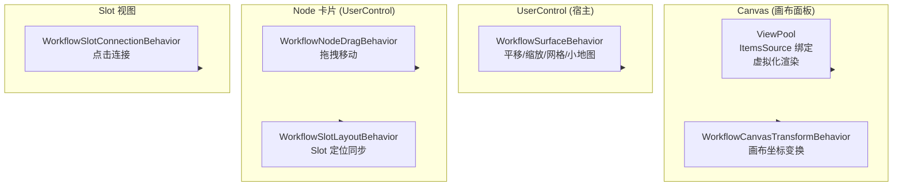

# 附加行为架构

附加行为（Attached Behaviors）位于 `VeloxDev.WorkflowSystem.AttachedBehaviors` 命名空间，通过 **WPF 附加属性**（DependencyProperty）为工作流画布提供交互能力。各平台适配层均包含相同的行为集。

---

## 平台支持

| 行为 | WPF | Avalonia | WinUI | MAUI | WinForms | Blazor |
|------|:---:|:--------:|:-----:|:----:|:--------:|:------:|
| `WorkflowSurfaceBehavior` | ✅ | ✅ | ✅ | ✅ | ❌¹ | ❌ |
| `WorkflowNodeDragBehavior` | ✅ | ✅ | ✅ | ✅ | ❌¹ | ❌ |
| `WorkflowSlotConnectionBehavior` | ✅ | ✅ | ✅ | ✅ | ❌¹ | ❌ |
| `WorkflowSlotLayoutBehavior` | ✅ | ✅ | ✅ | ✅ | ❌¹ | ❌ |
| `WorkflowCanvasTransformBehavior` | ✅ | ✅ | ✅ | ✅ | ❌ | ❌ |
| `WorkflowMinimapOverlay` | ✅ | ✅ | ✅ | ✅ | ❌ | ❌ |
| `ViewPool` | ✅ | ✅ | ✅ | ✅ | ❌ | ❌ |

> ¹ WinForms 使用自绘控件 + Panel、无附加属性系统，交互通过直接的事件处理器实现，见 `WorkflowCanvas.cs`。

## 架构层次



## 行为总表

| 行为 | 作用 | 附加目标 |
|------|------|----------|
| `WorkflowSurfaceBehavior` | 平移、缩放、网格装饰器、小地图 | 宿主 UserControl |
| `WorkflowNodeDragBehavior` | 节点拖拽移动 | 节点 UserControl（头部区域） |
| `WorkflowSlotConnectionBehavior` | 点击 Slot 发起/接受连接 | Slot 控件 |
| `WorkflowSlotLayoutBehavior` | Slot 锚点位置与 Canvas 坐标同步 | 节点 UserControl |
| `WorkflowCanvasTransformBehavior` | 画布坐标变换通知（不绑定到宿主自身） | Canvas（需在 XAML 中绑定 RenderTransform） |
| `WorkflowMinimapOverlay` | 小地图概览控件 | 宿主内 FrameworkElement |
| `ViewPool` | ItemsSource 绑定 + 视图池化渲染 | Panel |

## 基础架构组件

### ViewManager

`ViewManager` 是 `ViewPool` 的内部引擎，管理视图对象的**对象池**和**增量渲染**：

```csharp
public sealed class ViewManager(Panel panel)
{
    public void Attach(INotifyCollectionChanged collection);  // 绑定集合
    public void Detach();                                     // 解绑并清理
    public void RegisterTemplate(Type viewModelType, DataTemplate template); // 注册模板
}
```

- 集合变更时增量添加/移除视图
- 视图回收至对象池避免频繁创建
- 渲染分批调度避免阻塞 UI 线程

### ViewPool

在 XAML Panel 上使用的附加属性：

```xml
<Canvas helpers:ViewPool.ItemsSource="{Binding Nodes}"
        helpers:ViewPool.TemplateSelector="{StaticResource WorkflowTemplateSelector}" />
```

| 附加属性 | 类型 | 说明 |
|---------|------|------|
| `ItemsSource` | `INotifyCollectionChanged` | 绑定的 ViewModel 集合 |
| `TemplateSelector` | `DataTemplateSelector` | 按类型选择 DataTemplate |

### IWorkflowGridDecorator

```csharp
public interface IWorkflowGridDecorator
{
    // 由 WorkflowSurfaceBehavior 调用
}
```

### IWorkflowMinimapOverlay

```csharp
public interface IWorkflowMinimapOverlay
{
    // 由 WorkflowSurfaceBehavior 管理
}
```

各子页面详述每个行为的完整 API 和用法。
