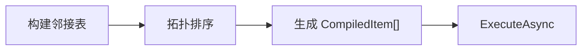

# 编译

`WorkflowCompiler` 将节点图转换为**有序执行计划**，是工作流引擎的核心编排器。

## 编译流水线



## 编译四维度（2 × 2 × 2 × 3 = 24 种策略）

| 维度 | 可选值 | 说明 |
|------|--------|------|
| Mode（模式） | `BFS` / `DFS` | 广度/深度优先遍历 |
| Direction（方向） | `Forward` / `Reverse` | 沿输出/输入方向 |
| Scope（范围） | `FromNode` / `Omni` | 单子图/自动发现边界 |
| CycleHandling（环路） | `Throw` / `Trim` / `Allow` | 抛异常/跳过已访问/保留元数据 |

```csharp
using VeloxDev.WorkflowSystem.Compilation;

var compiler = new WorkflowCompiler();
var results = compiler.Compile(startNode, CompileMode.BFS,
    CompileDirection.Forward, CompileScope.FromNode, CycleHandling.Throw);
var plan = results[0];
var finalResult = await plan.ExecuteAsync("seed");
```

## 编译结果

| 属性 | 说明 |
|------|------|
| `Items` | 有序的 `CompiledItem` 列表，按执行顺序排列 |
| `ExecuteAsync(parameter)` | 异步执行整个计划 |

## 执行事件钩子

| 事件 | 参数 | 触发时机 |
|------|------|----------|
| `ExecutionEvent.NodeStarted` | `ExecutionContext` | 节点开始执行前 |
| `ExecutionEvent.NodeCompleted` | `ExecutionContext` | 节点执行完成后 |
| `ExecutionEvent.PipelineCompleted` | — | 整条流水线完成 |

通过 `ICompileTimeSink` 接口可注册自定义事件接收器，用于日志、遥测和调试。
