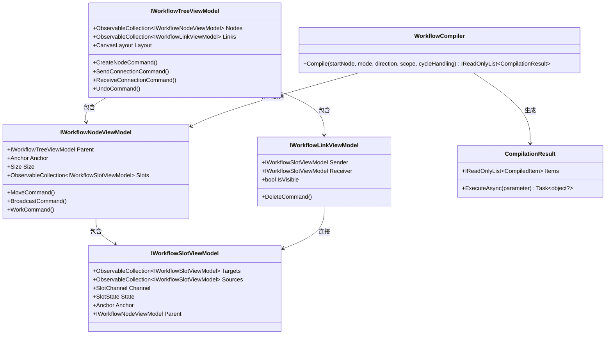
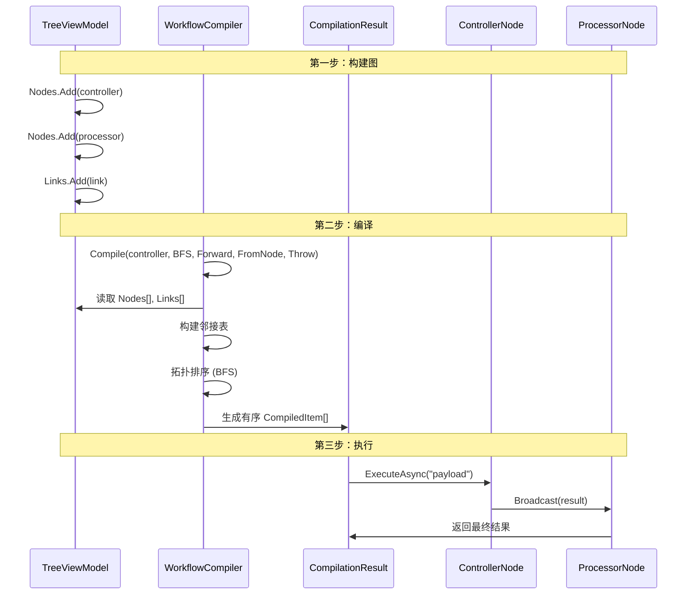

# 工作流引擎

工作流引擎是一个**基于图拓扑的编译执行系统**。它将工作流建模为有向图，其中 Node（顶点）通过 Link（边）经过 Slot（端点）连接。

---

## 软件架构：四组件模型



### 组件职责

| 组件 | 职责 | 关键模式 |
|------|------|----------|
| **Tree** | 根容器；拥有所有节点、连接、撤销栈 | Composite |
| **Node** | 可执行单元；持有 Slot 和业务逻辑 | Command |
| **Slot** | 类型化连接端点；维护 Target/Source 集合 | Observer |
| **Link** | 两个 Slot 间的可视化连接 | Value Object |
| **Helper** | 自定义行为的扩展点 | Strategy |

---

## 编译与执行（时序图）



---

## 24 种编译策略

编译器提供四个正交维度，组合出 **2 × 2 × 2 × 3 = 24 种策略**：

| 维度 | 值 | 描述 |
|------|-----|------|
| **Mode** | `BFS` / `DFS` | 广度优先 vs 深度优先 |
| **Direction** | `Forward` / `Reverse` | 沿输出方向 vs 沿输入方向 |
| **Scope** | `FromNode` / `Omni` | 单子图 vs 自动发现边界 |
| **CycleHandling** | `Throw` / `Trim` / `Allow` | 环路报错 / 跳过已访问 / 保留元数据 |

---

## Helper 模式（策略模式）

每个组件将行为委托给 **Helper** 对象，通过源码生成器注入：

```
[WorkflowBuilder.Node<CustomHelper>]
public partial class MyNode : NodeDefaultViewModel
    ↑                          ↑
    源码生成器                   基类（含
    注入 Helper                [VeloxCommand] 等）
```

Helper 可重写的方法：

| Helper 方法 | 调用时机 | 默认行为 |
|------------|----------|----------|
| `Install(component)` | 构造函数 | 绑定命令、附加事件 |
| `WorkAsync(parameter, ct)` | 执行过程中 | 空（重写以添加业务逻辑） |
| `ReceiveAsync(parameter, sender, receiver, ct)` | 收到数据时 | 空 |
| `BroadcastAsync(parameter, ct)` | 节点向下游发信号 | 转发到所有输出 Slot |
| `CloseAsync()` | 工作流停止 | 清理资源 |
