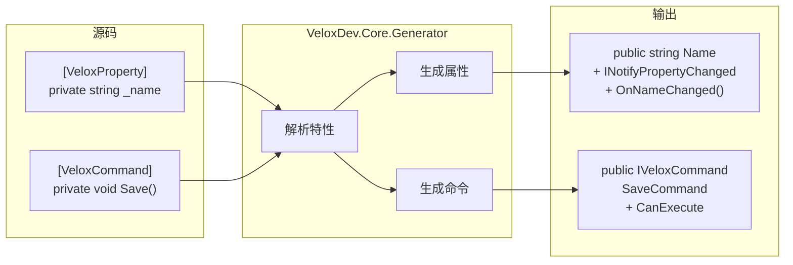

# MVVM 架构

VeloxDev 的 MVVM 层基于 **Roslyn 源码生成器**，编译期生成零运行时开销的通知属性和命令。

---

## 源码生成器流水线



## VeloxProperty 生成器

标记**字段**或**partial 属性**，生成：

- 公开 CLR 属性
- `INotifyPropertyChanging` / `INotifyPropertyChanged` 实现
- `partial void On{Name}Changed(T oldValue, T newValue)` 钩子

## VeloxCommand 生成器

标记**方法**，生成 `ICommand` 包装（方法名 `Save` → 属性名 `SaveCommand`）。

### 支持的方法签名

| 签名 | CanExecute | 取消 |
|-----------|------------|------|
| `void Method()` | — | — |
| `void Method(object?)` | — | — |
| `Task Method()` | — | — |
| `Task Method(CancellationToken)` | — | ✓ |
| `Task Method(object?, CancellationToken)` | — | ✓ |
| `canValidate: true` | `bool CanMethod()` | — |

### 命令生命周期事件

```
Created → Enqueued → Dequeued → Started → Completed
                                        ↘ Failed
                                        ↘ Canceled
```

## 设计理念

- **零依赖**：无需 ReactiveUI、CommunityToolkit 或 Fody
- **编译时**：无反射、无运行时代码生成
- **Partial 方法**：通过 `partial void On{Name}Changed` 扩展
- **并发控制**：`semaphore` 参数限制并行执行数
