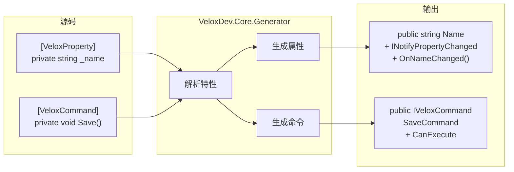
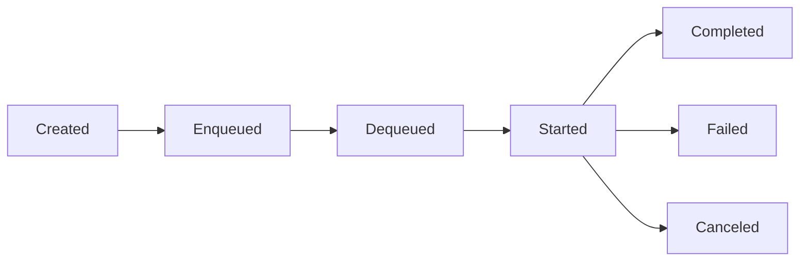

# MVVM 架构

VeloxDev 的 MVVM 层基于 **Roslyn 源码生成器**，编译期生成零运行时开销的通知属性和命令。

---

## 源码生成器流水线



## VeloxProperty 生成器

标记**字段**或 **partial 属性**，生成完整通知属性：

```csharp
[VeloxProperty] private string _name;
```
生成：
```csharp
public string Name
{
    get => _name;
    set
    {
        if (EqualityComparer<string>.Default.Equals(_name, value)) return;
        var old = _name;
        _name = value;
        OnPropertyChanging();
        OnPropertyChanged();
        OnNameChanged(old, value);    // partial 钩子
    }
}
// partial void OnNameChanged(string oldValue, string newValue);
```

### 级联刷新

```csharp
[VeloxProperty(cascade: [nameof(FullName)])]
private string _firstName;
// 当 FirstName 变化时，自动触发 FullName 的 PropertyChanged
```

## VeloxCommand 生成器

### 支持的方法签名

| 签名 | CanExecute | 取消 | 说明 |
|-----------|------------|------|------|
| `void Method()` | — | — | 同步无参 |
| `void Method(object?)` | — | — | 同步有参 |
| `Task Method()` | — | — | 异步无参 |
| `Task Method(CancellationToken)` | — | ✓ | 异步可取消 |
| `Task Method(object?, CancellationToken)` | — | ✓ | 异步有参可取消 |
| `canValidate: true` | `partial bool CanExecute{Name}Command(object?)` | — | 编译器生成 partial 方法，需用户实现 |

### 命令生命周期



### 并发控制

```csharp
[VeloxCommand(semaphore: 1)]  // 最多 1 个并发执行
private async Task SaveAsync() { ... }
```

## 设计理念

| 特性 | VeloxDev | CommunityToolkit.Mvvm | ReactiveUI |
|------|----------|----------------------|------------|
| 依赖 | 零依赖 | Microsoft.SourceLink | Reactive* 全家桶 |
| 运行时生成 | 无（编译时） | 无（编译时） | 无（编译时） |
| `ICommand` 实现 | 内建 | 内建 | 内建 |
| 异步支持 | 内建 | 通过 `AsyncRelayCommand` | 通过 `ReactiveCommand` |
| 取消令牌 | 编译期自动 | 需手动 | 需手动 |
| 并发控制 | 编译期 `semaphore` 参数 | 需手动 | 需手动 |
