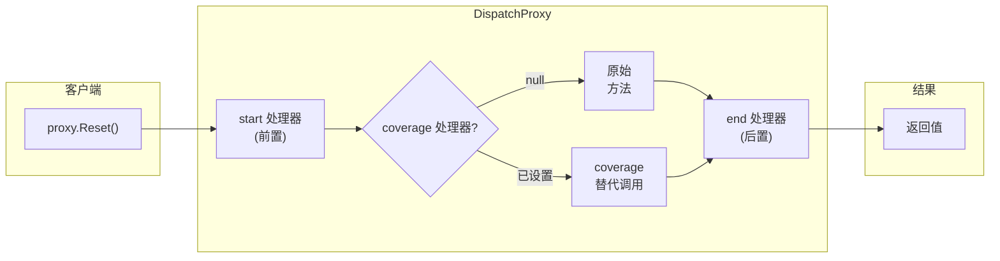

# AOP 架构

AOP 基于 **`DispatchProxy`** 实现 — 运行时拦截，无需编译时织入。

---

## 代理链模式



## 三个处理器插槽

| 位置 | 委托 | 接收参数 | 返回 | 作用 |
|------|------|----------|------|------|
| **start**（前置） | `ProxyHandler` | `(args, null)` | 传递给 coverage | 日志、验证、安全检查 |
| **coverage**（替代） | `ProxyHandler` | `(args, startResult)` | 方法返回值 | `null`=原方法；非null=替代结果 |
| **end**（后置） | `ProxyHandler` | `(args, result)` | 返回给调用方 | 日志、度量、审计 |

## 完整 API

### `IAspectOriented`

标记接口，所有需要 AOP 代理的 class 必须实现此接口（由 `[AspectOriented]` 源码生成器自动添加）。

### `[AspectOriented]`

标记需要拦截的成员（方法/属性）。仅标记的成员会被 DispatchProxy 拦截。

```csharp
[AspectOriented]
public void Reset() { ... }
```

### `target.Aop()`

获取或创建并缓存 `DispatchProxy` 实例。重复调用返回同一代理。

```csharp
var proxy = data.Aop();  // 首次创建并缓存，之后返回同一实例
```

### `proxy.SetProxy()`

```csharp
proxy.SetProxy(
    ProxyMembers.Getter,                    // Getter / Setter / Method
    "MemberName",                           // 成员名称
    start: startHandler,                    // 前置处理器（可选）
    coverage: coverageHandler,              // 替代处理器（可选，null=执行原方法）
    end: endHandler                         // 后置处理器（可选）
);
```

### `ProxyHandler` 委托

```csharp
public delegate object? ProxyHandler(object?[]? parameters, object? previous);
// parameters: 调用参数数组
// previous: 前一处理器返回值（start→coverage→end 链条传递）
```

## 生命周期

1. `target.Aop()` 返回已缓存的 DispatchProxy 实例
2. 调用 `proxy.Member` 时，`DispatchProxy.Invoke` 拦截调用
3. 按 **start → coverage → end** 顺序执行处理器链
4. coverage 返回非 null 时跳过原方法

## 使用场景

| 场景 | 推荐处理器 |
|------|-----------|
| 读取/写入日志追踪 | Getter/Setter 的 start 或 end |
| 方法调用日志 | Method 的 start + end |
| 权限验证（拦截访问） | start（抛异常阻断） |
| 结果替换 / 缓存 | coverage（返回缓存结果） |
| 变更通知 / 审计 | end |

完整示例见 [Examples/AOP/WPF](https://github.com/Axvser/VeloxDev/tree/master/Examples/AOP/WPF/Demo)
