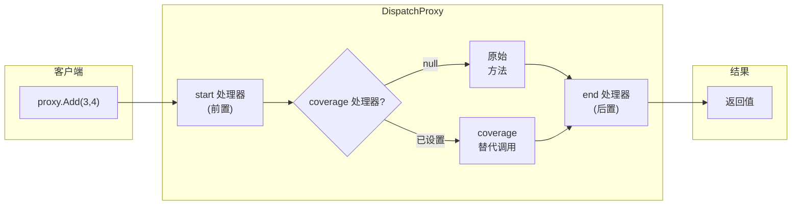

# AOP 架构

AOP 基于 **`DispatchProxy`** 实现 — 运行时拦截，无需编译时织入。

---

## 代理链模式

## 三个处理器插槽

| 位置 | 委托 | 接收 | 返回 | 作用 |
|------|------|------|------|------|
| **start** | `ProxyHandler` | `(args, null)` | `object?`（忽略）| 日志、验证、安全检查 |
| **coverage** | `ProxyHandler` | `(args, startResult)` | `object?` | null=原方法；非null=替代结果 |
| **end** | `ProxyHandler` | `(args, result)` | `object?`（返回调用方）| 日志、度量、审计 |

## 性能特性

- `DispatchProxy` 使用轻量级 IL emit — 每次调用无反射
- 处理器存储在 `Dictionary<string, Tuple>` — O(1) 查找
- 仅 `[AspectOriented]` 标记的成员被拦截，未标记成员全速通过
