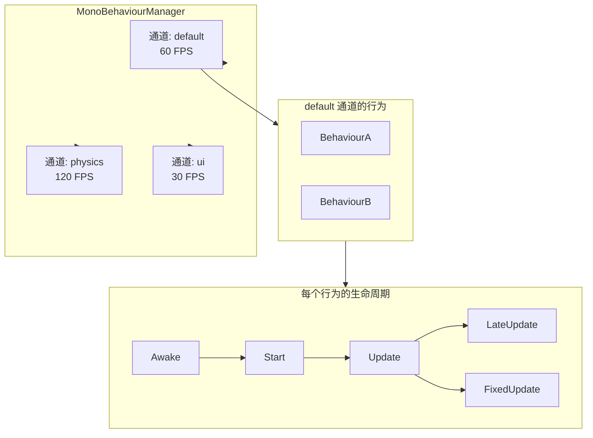
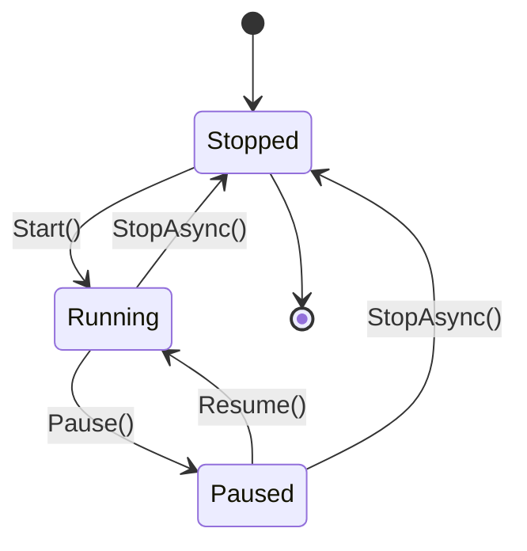

# 帧循环架构

帧循环由 **`MonoBehaviourManager`** 驱动 — 一个受 Unity 启发的多通道生命周期系统。

---

## 多通道架构

## 通道状态机

## 帧循环内部

每个通道运行两个独立循环：

| 循环 | 速率 | 驱动 | 默认 |
|------|------|------|------|
| **Update** | 可配置 FPS (1–1000) | `Update()`, `LateUpdate()` | 60 FPS |
| **FixedUpdate** | 固定间隔 (ms) | `FixedUpdate()` | 16 ms (~60 Hz) |

两种执行模式：
- **线程模式**：专用后台线程，精密自旋等待
- **异步模式**：`async/await` 循环（通过 `SetUseAsyncLoop(true)` 设置）

## 性能特性

- **合并不**同帧内的冗余失效请求
- **TimeScale**：0–10× 速度倍率
- **对象池**：FrameEventArgs 和配置变更请求池化，减少 GC 压力
- **精确休眠**：混合自旋 + `Thread.Sleep(1)`，亚毫秒精度
