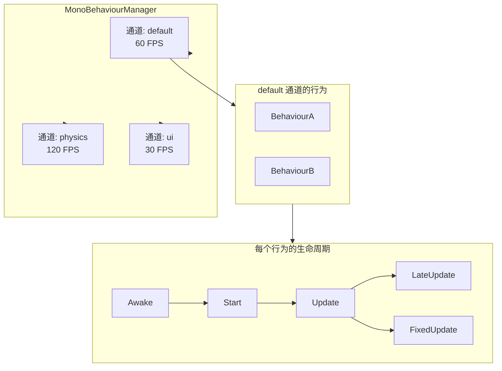
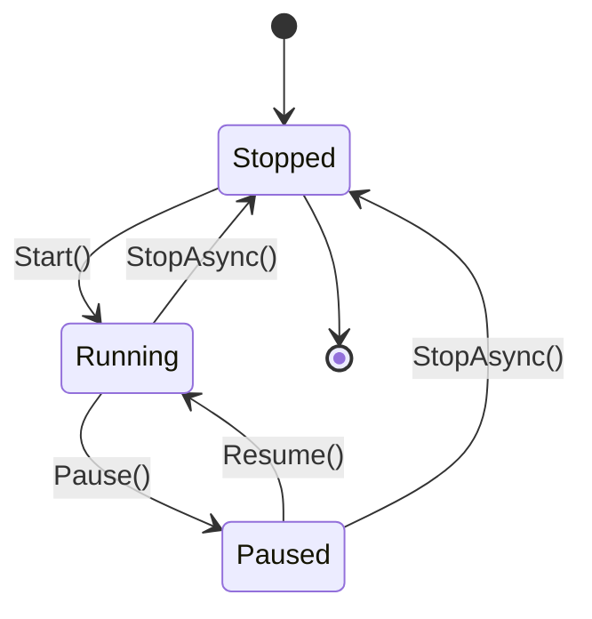

# 帧循环架构

帧循环由 **`MonoBehaviourManager`** 驱动 — 一个受 Unity 启发的多通道生命周期系统。

---

## 多通道架构



## 通道状态机



## 完整 API

### `[MonoBehaviour]` 特性

```csharp
[MonoBehaviour(channel: "default", fps: -1)]
// channel: 通道名称（默认 "default"）
// fps: 目标帧率（-1 表示沿用通道现有设置）
```

编译器生成的内容：

```csharp
// 生成的接口
public partial class MyBehaviour : IMonoBehaviour
{
    // 注册/注销方法
    public void InitializeMonoBehaviour();
    public void CloseMonoBehaviour();

    // 以下 partial 方法由用户自行实现
    partial void Awake();
    partial void Start();
    partial void Update(FrameEventArgs e);
    partial void LateUpdate(FrameEventArgs e);
    partial void FixedUpdate(FrameEventArgs e);
}
```

### MonoBehaviourManager 静态方法

| 方法 | 说明 |
|------|------|
| `RegisterBehaviour(behaviour, channel)` | 注册行为到指定通道 |
| `UnregisterBehaviour(behaviour, channel)` | 从通道注销行为 |
| `Start(channel)` | 启动通道帧循环 |
| `StopAsync(channel)` | 停止通道帧循环（可 await） |
| `Pause(channel)` | 暂停通道 |
| `Resume(channel)` | 恢复通道 |
| `SetTargetFPS(fps, channel)` | 运行时修改目标帧率 |
| `SetTimeScale(scale, channel)` | 设置时间倍率 0–10x |
| `SetUseAsyncLoop(useAsync, channel)` | 切换异步循环模式 |

每个通道运行两个独立循环：

| 循环 | 速率 | 驱动 | 默认 |
|------|------|------|------|
| **Update** | 可配置 FPS (1–1000) | `Update()`, `LateUpdate()` | 60 FPS |
| **FixedUpdate** | 固定间隔 (ms) | `FixedUpdate()` | 16 ms (~60 Hz) |

两种执行模式：
- **线程模式**：专用后台线程，精密自旋等待（默认）
- **异步模式**：`async/await` 循环（通过 `SetUseAsyncLoop(true)` 设置）

## 完整 API

### MonoBehaviourManager 静态方法

| 方法 | 说明 |
|------|------|
| `RegisterBehaviour(behaviour, channel)` | 注册行为到指定通道 |
| `UnregisterBehaviour(behaviour, channel)` | 从通道注销行为 |
| `Start(channel)` | 启动通道帧循环 |
| `StopAsync(channel)` | 停止通道帧循环 |
| `Pause(channel)` | 暂停通道 |
| `Resume(channel)` | 恢复通道 |
| `SetTargetFPS(fps, channel)` | 设置目标帧率 |
| `SetTimeScale(scale, channel)` | 设置时间倍率 0–10x |
| `SetUseAsyncLoop(useAsync, channel)` | 切换异步模式 |

### FrameEventArgs

| 属性 | 类型 | 描述 |
|------|------|------|
| `DeltaTime` | `TimeSpan` | 距上一帧的时间差 |
| `TotalTime` | `TimeSpan` | 通道总运行时间 |
| `CurrentFPS` | `int` | 实际帧率 |
| `TargetFPS` | `int` | 目标帧率 |
| `FrameCount` | `long` | 自启动以来的总帧数 |

## 性能特性

- **合并不**同帧内的冗余失效请求
- **TimeScale**：0–10× 速度倍率
- **对象池**：FrameEventArgs 和配置变更请求池化，减少 GC 压力
- **精确休眠**：混合自旋 + `Thread.Sleep(1)`，亚毫秒精度
- **通道隔离**：各通道独立线程、独立帧率、独立时间缩放
