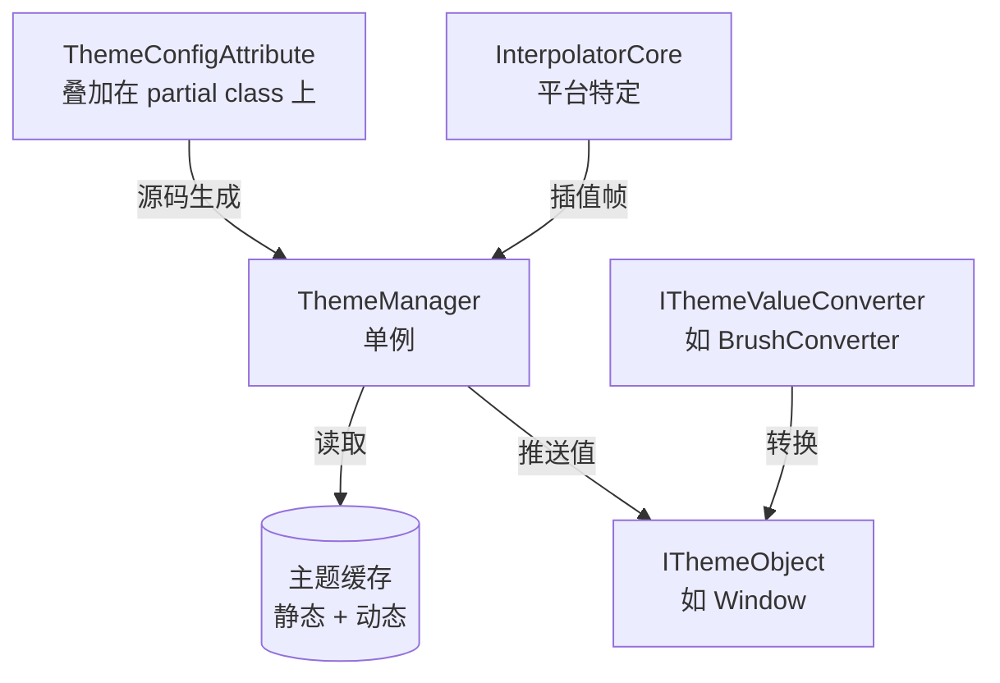

# 主题系统架构

动态主题系统遵循**发布-订阅模式**：`ThemeManager` 单例向所有已注册的 `IThemeObject` 实例广播主题变更。

---

## 架构



## 主题切换过程

```mermaid
sequenceDiagram
    participant App
    participant Manager as ThemeManager
    participant Cache as ThemeCache
    participant Target as IThemeObject

    App->>Manager: Transition&lt;Light&gt;(effect)
    Manager->>Manager: CancleTransition()
    Manager->>Cache: CalculateFrames(steps, ease)
    Cache-->>Manager: Queue~Action~ 帧
    loop 每帧
        Manager->>Target: 应用下一帧插值
    end
    Manager->>Target: ExecuteThemeChanged(old, new)
```

## 三层缓存架构

| 缓存 | 范围 | 填充方式 | 使用时机 |
|------|------|----------|----------|
| **静态** (`_def_cache`) | 全局按类型 | `ThemeConfigAttribute` | 初始主题加载 |
| **动态** (`_act_cache`) | 按实例 | 运行时 `SetThemeValue<T>()` | 动态覆盖 |
| **帧**（计算） | 按过渡 | `CalculateFrames()` | 动画过渡期间 |

查找顺序：动态覆盖静态，帧缓存覆盖两者。

## 平台集成

各平台适配层提供：
- **`Interpolator`**：平台特定插值引擎
- **转换器**：`BrushConverter`、`ColorConverter`、`ThicknessConverter` 等
- **`TransitionEffects`**：预置效果（如 `TransitionEffects.Theme`）
