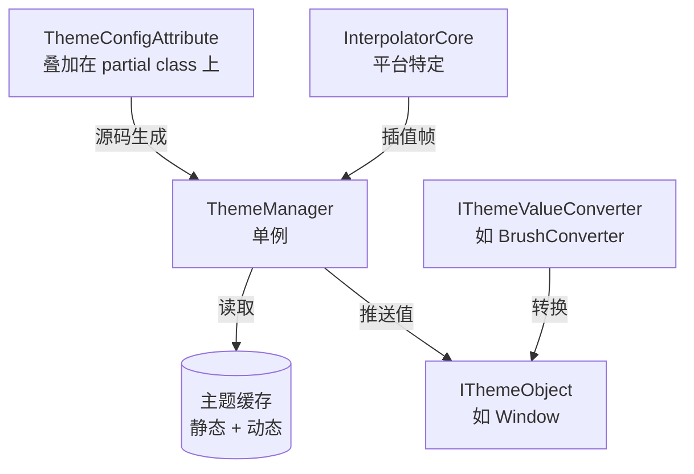
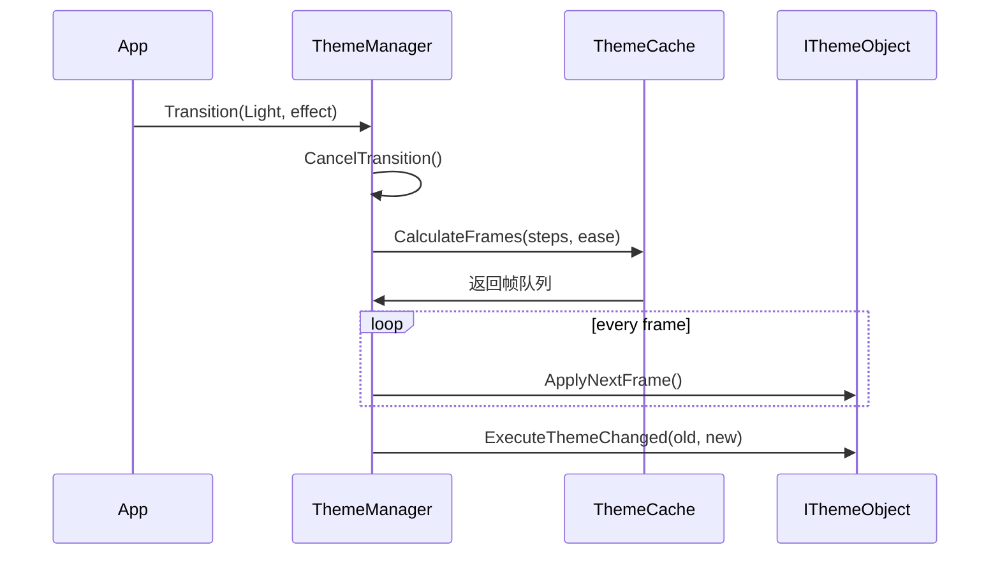

# 主题系统架构

动态主题系统遵循**发布-订阅模式**：`ThemeManager` 单例向所有已注册的 `IThemeObject` 实例广播主题变更。

---

## 架构



## 主题切换过程



## 三层缓存架构

| 缓存 | 范围 | 填充方式 | 使用时机 |
|------|------|----------|----------|
| **静态** (`_def_cache`) | 全局按类型 | `ThemeConfigAttribute` | 初始主题加载 |
| **动态** (`_act_cache`) | 按实例 | 运行时 `SetThemeValue<T>()` | 动态覆盖 |
| **帧**（计算） | 按过渡 | `CalculateFrames()` | 动画过渡期间 |

查找顺序：动态覆盖静态，帧缓存覆盖两者。

## 平台集成

各平台适配层提供：
- **`Interpolator`**：平台特定插值引擎
- **转换器**：`BrushConverter`、`ColorConverter`、`ThicknessConverter` 等
- **`TransitionEffects`**：预置效果（如 `TransitionEffects.Theme`）

## 完整 API

### ThemeManager 静态 API

| 方法 | 说明 |
|------|------|
| `Jump<T>()` | 即时切换到主题 T |
| `Transition<T>(TransitionEffect)` | 带动画过渡到主题 T |
| `Transition(Type, TransitionEffect)` | 运行时类型切换 |
| `RegisterThemeObject(IThemeObject)` | 注册主题感知对象 |
| `UnregisterThemeObject(IThemeObject)` | 注销主题感知对象 |
| `SetPlatformInterpolator(Interpolator)` | 设置平台插值器（动画必需） |
| `SetThemeValue<T>(name, value)` | 运行时动态覆盖属性值 |
| `StartModel` | `Cache` / `Direct` 缓存模式 |

### 主题声明

```csharp
// [ThemeConfig<TConverter, TLight, TDark>(propertyName, lightValues, darkValues)]
[ThemeConfig<BrushConverter, Light, Dark>(nameof(Background), ["#ffffff"], ["#1e1e1e"])]
[ThemeConfig<BrushConverter, Light, Dark>(nameof(Foreground), ["#1e1e1e"], ["#ffffff"])]
public partial class MainWindow : Window { ... }
```

### 生命周期钩子

```csharp
// 在每个主题切换完成后自动调用
partial void OnThemeChanged(Type? oldTheme, Type? newTheme)
{
    // 自定义逻辑
}
```

### 三层缓存架构

| 缓存 | 范围 | 填充方式 | 使用时机 |
|------|------|----------|----------|
| **静态** (`_def_cache`) | 全局按类型 | `ThemeConfigAttribute` | 初始主题加载 |
| **动态** (`_act_cache`) | 按实例 | 运行时 `SetThemeValue<T>()` | 动态覆盖 |
| **帧**（计算） | 按过渡 | `CalculateFrames()` | 动画过渡期间 |

查找顺序：动态覆盖静态，帧缓存覆盖两者。
