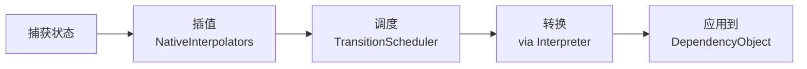

# 动画架构

动画系统基于**状态快照插值**。每个动画在某时刻捕获属性值，然后通过缓动曲线向目标值插值。

---

## 三种动画模式

```mermaid
flowchart TB
    subgraph Snapshot[快照模式]
        S1[SnapshotAll()] --> S2[修改属性]
        S2 --> S3[Effect(...).Execute(target)]
    end

    subgraph Property[属性模式]
        P1[Transition&lt;T&gt;.Create()] --> P2[.Property(lambda, value)]
        P2 --> P3[.Effect(...).Execute(target)]
    end

    subgraph Theme[主题模式]
        T1[ThemeManager.Transition&lt;Theme&gt;(effect)]
    end
```

## 插值流水线



### 组件分解

| 层 | 类 | 职责 |
|----|-----|------|
| **状态** | `StateSnapshot`, `IFrameState` | 在某个时间点捕获属性值 |
| **插值** | `InterpolatorCore`, 14+ `NativeInterpolators` | 计算 `double`、`Point`、`Color` 等的中间值 |
| **调度** | `TransitionSchedulerCore` | 管理每目标的动画队列，支持互斥 |
| **解释** | `TransitionInterpreterCore` | 在 UI 线程上将计算帧应用于目标 |
| **缓动** | `Eases`（8 系列 × 3 模式 = 24 条曲线） | 将线性时间转换为曲线时间 |

## 原生插值器

| 类型 | 插值器 |
|------|--------|
| `double` | `DoubleInterpolator` |
| `float` | `FloatInterpolator` |
| `Point` | `PointInterpolator` |
| `Size` | `SizeInterpolator` |
| `Color` | `ColorInterpolator` |
| `Vector2/3/4` | `Vector*Interpolator` |
| `Quaternion` | `QuaternionInterpolator` |
| `Anchor` | `Anchor.Interpolate()` |
