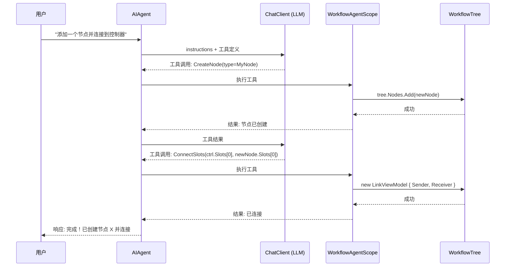
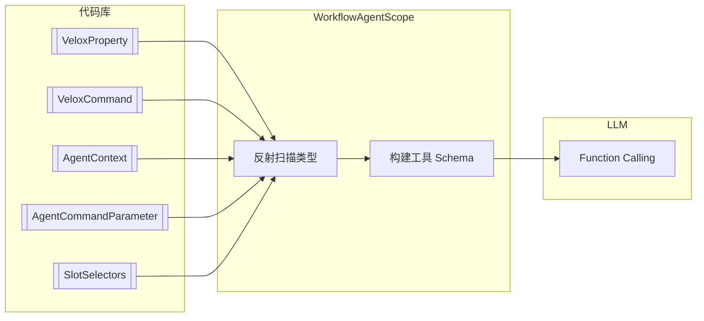

# 智能体架构

基于 **MAF（Model-Aware Function）框架**，将工作流组件元数据转换为 LLM 可理解的工具定义，实现自然语言驱动的图操作。MAF 框架分为两层：**Core 层**（基础特性标记、命令发现、类型解析）和 **Extension 层**（`WorkflowAgentScope`、嵌入式资源、MCP 集成）。

---

## 工具调用流程



## MAF 工具生成流水线



## AI 特性标记全集

所有标记均定义在 `VeloxDev.Core` 中，不依赖 Extension 层即可使用。

| 特性 | 目标 | 作用 | 多语言 |
|------|------|------|--------|
| `[AgentContext(lang, description)]` | 类/属性/方法/字段 | 为智能体提供人类可读的描述 | ✅ 33 种语言 |
| `[AgentCommandParameter]` | 属性/方法/字段 | 指定命令参数类型（`null` = 无参） | ❌ |
| `[AgentCommandParameter(typeof(T))]` | 同上 | 声明具体 .NET 参数类型 | ❌ |
| `[SlotSelectors(typeof(Enum))]` | SlotEnumerator 属性 | 声明条件 Slot 的允许枚举类型 | ❌ |

### `[AgentContext]` 详解

允许重复标注（`AllowMultiple = true`），可同时提供多语言描述。

```csharp
// 支持 33 种语言
[AgentContext(AgentLanguages.Chinese, "NetworkFlow 中转节点")]
[AgentContext(AgentLanguages.English, "NetworkFlow relay node.")]
[AgentContext(AgentLanguages.Japanese, "NetworkFlow中継ノード")]
[WorkflowBuilder.Node<HttpHelper<NodeViewModel>>(workSemaphore: 5)]
public partial class NodeViewModel { ... }
```

### `[AgentCommandParameter]` 详解

声明命令的参数类型，智能体会在调用前构造正确类型的参数。

```csharp
[AgentCommandParameter(typeof(string))]  // 需 string 类型参数
[VeloxCommand]
private async Task SetUrl(object? parameter, CancellationToken ct) { ... }

[AgentCommandParameter]  // 无参命令
[VeloxCommand]
private async Task Process(CancellationToken ct) { ... }
```

### `[SlotSelectors]` 详解

仅用于 `SlotEnumerator<TSlot>` 类型的属性，声明允许的选择器枚举。

```csharp
[SlotSelectors(typeof(MyEnum), typeof(OtherEnum))]
[VeloxProperty] public partial SlotEnumerator<SlotViewModel> OutputSlots { get; set; }
```

## WorkflowAgentScope 完整配置

位于 `VeloxDev.Core.Extension`，通过 `tree.AsAgentScope()` 创建。

```csharp
var scope = tree.AsAgentScope()

    // ── 基本配置 ─────────────────────────────────
    .WithPromptLanguage(AgentLanguages.Chinese)   // 提示语言（默认 English）
    .WithAutoDiscovery("VeloxDev.Core")           // 自动扫描程序集
    .WithMaxToolCalls(200)                        // 最大工具调用轮次（默认 50）

    // ── 自定义类型注册 ──────────────────────────
    .WithComponents(typeof(MyNode))               // 注册自定义节点
    .WithInterfaces(typeof(IMyService))           // 注册自定义接口
    .WithEnums(typeof(MyEnum))                    // 注册自定义枚举
    .WithData(typeof(MyDto))                      // 注册自定义数据对象

    // ── 安全与状态 ──────────────────────────────
    .WithConfirmationLevel(ConfirmationLevel.Level1)  // 安全等级
    .WithAutoMarkDirty(true);                         // 自动标记已修改
```

### 安全等级

| 等级 | 行为 |
|------|------|
| `Level0` 自动 | 允许所有变更 |
| `Level1` 谨慎 | 破坏性操作需确认（推荐） |
| `Level2` 确认 | 所有变更需确认 |
| `Level3` 严格 | 默认只读，每次变更需显式批准 |

### 工具提供

| 方法 | 返回 | 说明 |
|------|------|------|
| `ProvideTools()` | `AITool[]` | 供 LLM 使用的工具定义 |
| `ProvideProgressiveContextPrompt()` | `string` | 当前工作流拓扑文本描述 |
| `ExecuteToolAsync(name, args)` | `Task<string>` | 执行命名的工具 |

### 工具调用事件

```csharp
scope.ToolCalled += (sender, e) =>
{
    Console.WriteLine($"工具: {e.ToolName}, 参数: {string.Join(", ", e.Arguments)}");
};
```

## AgentCommandDiscoverer

通用命令发现器，不依赖 Scope，可在任意对象上发现 `ICommand`。

```csharp
// 发现命令
var commands = AgentCommandDiscoverer.DiscoverCommands(
    myViewModel, AgentLanguages.Chinese);

foreach (var cmd in commands)
    Console.WriteLine($"命令: {cmd.Name}, 参数类型: {cmd.ParameterType?.Name ?? "无"}, 可否执行: {cmd.CanExecute}");

// 执行命令
var result = await AgentCommandDiscoverer.ExecuteAsync(
    myViewModel, commands[0], "parameter");
```

| CommandDescriptor | 说明 |
|-------------------|------|
| `Name` | 命令属性名 |
| `ParameterType` | `[AgentCommandParameter]` 声明的类型 |
| `AgentDescriptions` | `[AgentContext]` 描述集合 |
| `CanExecute` | 当前是否可执行 |

## 确认事件

```csharp
((IAgentConfirmationNotifier)scope).ConfirmationRequested += (sender, e) =>
{
    Console.WriteLine($"需要确认: {e.Description}");
    e.Result = AgentConfirmationResult.AllowOnce;
};
```

| `AgentConfirmationResult` | 行为 |
|---------------------------|------|
| `AllowOnce` | 仅允许本次 |
| `AllowAlways` | 记住选择（按 `OperationKey`） |
| `Deny` | 拒绝 |

## Agent 工具集

Agent 工具由 `WorkflowAgentToolkit` 提供，从底层到上层分为六个层次。

### 第一层：查询工具（Query）

| 工具 | 说明 |
|------|------|
| `ListNodes` | 列出工作流中所有节点 |
| `GetNodeDetail` | 获取指定节点的详细信息 |
| `GetNodeDetailById` | 通过 RuntimeId 获取节点 |
| `ListConnections` | 列出所有连接关系 |
| `GetTypeSchema` | 获取 .NET 类型的 JSON Schema |

### 第二层：渐进式上下文与快照

| 工具 | 说明 |
|------|------|
| `GetWorkflowSummary` | 获取工作流的摘要描述 |
| `GetComponentContext` | 获取工作流组件支持的功能描述 |
| `ListComponentCommands` | 列出组件上可执行的命令 |
| `TakeSnapshot` | 记录当前状态快照 |
| `GetChangesSinceSnapshot` | 对比快照得到差异 |
| `MarkDirty` | 标记工作流已修改 |

### 第三层：节点与 Slot 变更

| 工具 | 说明 |
|------|------|
| `CreateNode` | 创建并配置节点 |
| `CreateAndConfigureNode` | 创建节点并同时设置属性 |
| `DeleteNode` | 删除节点 |
| `MoveNode` | 移动节点 |
| `SetNodePosition` | 设置节点精确位置 |
| `ResizeNode` | 调整节点尺寸 |
| `CreateSlotOnNode` | 在节点上创建新 Slot |
| `DeleteSlot` | 删除 Slot |
| `PatchNodeProperties` | 批量修改节点属性值 |
| `PatchComponentById` | 通过 RuntimeId 修改任意组件属性 |

### 第四层：连接管理

| 工具 | 说明 |
|------|------|
| `ConnectSlots` | 连接两个 Slot |
| `ConnectSlotsById` | 通过 RuntimeId 连接 Slot |
| `DisconnectSlots` | 断开两个 Slot |
| `DisconnectSlotsById` | 通过 RuntimeId 断开 |
| `DisconnectAllFromSlot` | 断开 Slot 的所有连接 |

### 第五层：执行与图遍历

| 工具 | 说明 |
|------|------|
| `ExecuteWork` | 触发节点的 WorkCommand |
| `BroadcastNode` | 触发节点的 BroadcastCommand |
| `ReverseBroadcastNode` | 触发节点的 ReverseBroadcastCommand |
| `ExecuteCommandOnNode` | 在节点上执行任意命令 |
| `ExecuteCommandById` | 通过 RuntimeId 执行命令 |
| `SearchForward` | 沿输出方向遍历图 |
| `SearchReverse` | 沿输入方向遍历图 |
| `SearchAllRelative` | 搜索全部关联节点 |
| `FindPath` | 查找两个节点间的路径 |
| `IsConnected` | 检查两个节点是否连通 |
| `FindNodes` | 按条件搜索节点 |
| `ResolveSlotId` | 解析 Slot RuntimeId 到详细信息 |
| `CloneNodes` | 克隆一组节点 |
| `BatchExecute` | 批量执行多个操作 |

### 第六层：条件 Slot 集合管理

| 工具 | 说明 |
|------|------|
| `ListSlotProperties` | 列出 SlotEnumerator 属性信息 |
| `AddSlotToCollection` | 向条件 Slot 集合添加条目 |
| `RemoveSlotFromCollection` | 从集合移除条目 |
| `SetEnumSlotCollection` | 用枚举值批量填充 Slot 集合 |
| `GetEnumSlotByValue` | 按枚举值获取对应 Slot |
| `SetEnumSlotChannel` | 设置条件 Slot 的通道类型 |
| `ConnectEnumSlot` | 连接条件 Slot |

### 撤销/重做

| 工具 | 说明 |
|------|------|
| `Undo` | 撤销上次操作 |
| `Redo` | 重做上次撤销 |

Toolkit 通过 `TrackedAIFunction` 包装，每次调用后自动触发 `ToolCalled` 事件。

## 完整调用链路

```
用户自然语言
  → AIAgent（AITool 调用）
    → WorkflowAgentScope.ExecuteToolAsync()
      → WorkflowAgentToolkit
        → ComponentPatcher（修改节点/属性）
        → CommandInvoker（执行命令）
        → TypeIntrospector（查询类型信息）
    → 结果返回 LLM
  → 自然语言回复用户
```

完整示例见 [Examples/Workflow/Common/Lib/](https://github.com/Axvser/VeloxDev/tree/master/Examples/Workflow/Common/Lib/)
