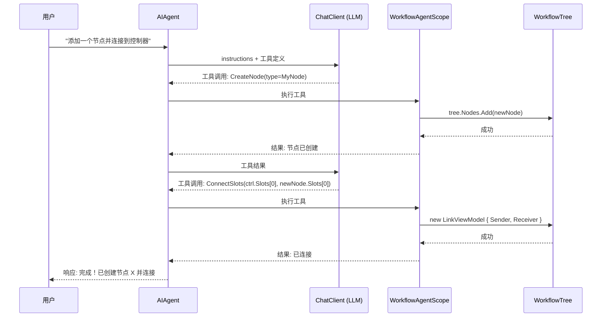
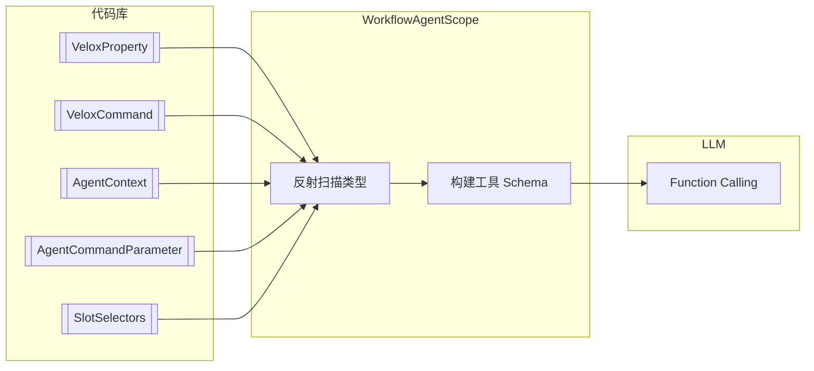
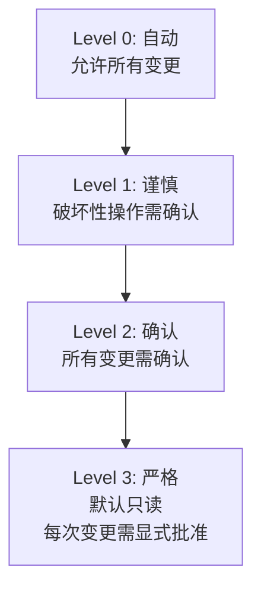

# 智能体架构

基于 **MAF（Model-Aware Function）框架**，将工作流组件元数据转换为 LLM 可理解的工具定义，实现自然语言驱动的图操作。

---

## 工具调用流程

## MAF 工具生成流水线

## 安全等级

## 上下文感知

| 特性 | 机制 |
|------|------|
| **渐进式上下文** | `ProvideProgressiveContextPrompt()` 生成当前图拓扑的文本描述 |
| **自动发现** | `WithAutoDiscovery(assembly)` 扫描 `[AgentContext]`、`[AgentCommandParameter]`、`[SlotSelectors]` |
| **自定义注册** | `WithComponents(types)`、`WithData(types)`、`WithEnums(types)` 用于领域特定类型 |
| **MCP 支持** | `McpServerConfiguration` 用于连接外部数据源 |
