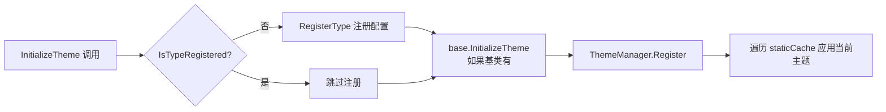

# 主题系统 ThemeCache 重构

> **涉及文件：**
>
> - `Src/Generators/VeloxDev.Core.Generator/Theme.cs`（+170 / -171，大幅重写）
> - `Src/Core/VeloxDev.Core/DynamicTheme/ThemeCache.cs`（**新增**）
>   **变更量：** +170 / -171 行

---

## 背景

此前每个带 `[ThemeConfig]` 的类会生成大量静态字典字段：

```
__velox__Converters__         — 转换器实例字典
__velox_Theme__Props__        — 属性名 → PropertyInfo 字典
__velox__Def__ThemeCache__    — 三层嵌套字典（属性名→PropertyInfo→主题类型→值）
__velox__Act__ThemeCache__    — 实例级活动覆盖字典
```

这导致：

- 每个主题类生成大量重复的静态字段代码
- 不支持继承链属性合并
- 方法不可重写（`public` 非 `virtual`）

## 改进设计

将所有主题数据统一委托给 `ThemeCache` 集中式缓存类，生成的类只包含方法实现。

### ThemeCache 类设计

**命名空间：** `VeloxDev.DynamicTheme`

| 组件             | 说明                                                                      |
| ---------------- | ------------------------------------------------------------------------- |
| `_staticCache` | `Dictionary<Type, Dictionary<string, PropertyEntry>>` — 类型级静态配置 |
| `_activeCache` | `ConditionalWeakTable<IThemeObject, InstanceCache>` — 实例级活动覆盖   |
| `_converters`  | `Dictionary<string, IThemeValueConverter>` — 全局转换器实例池          |

**核心 API：**

```csharp
public static class ThemeCache
{
    // 类型注册
    public static bool IsTypeRegistered(Type type);
    public static void RegisterType(Type type, Dictionary<string, (...)>> properties);

    // 静态缓存查询（继承链合并）
    public static Dictionary<string, ...> GetStaticForType(Type type);

    // 实例级活动缓存
    public static InstanceCache GetOrCreateActiveEntry(IThemeObject instance);
    public static InstanceCache? TryGetActiveEntry(IThemeObject instance);
    public static void RemoveActiveEntry(IThemeObject instance);

    // 默认值查找（继承链遍历）
    public static bool TryGetDefaultValue(Type type, string propertyName, Type themeType, out object? value);
}
```

### 继承链支持

`GetStaticForType(Type)` 通过递归遍历基类合并属性：

```mermaid
flowchart TD
    A[GetStaticForType(DerivedClass)] --> B[递归 CollectStaticForType]
    B --> C[先处理 BaseType]
    C --> D[再处理 DerivedClass]
    D --> E[派生类属性覆盖基类同名属性]
    E --> F[返回合并后字典]
```

### 方法可重写性

| 条件                                        | 生成的方法修饰符       |
| ------------------------------------------- | ---------------------- |
| 类是`sealed`                              | `public`（无修饰符） |
| 基类已有`[ThemeConfig]`（即生成器处理过） | `public override`    |
| 基类无`[ThemeConfig]` 或没有基类          | `public virtual`     |

### 惰性注册



---

## 转换器处理变更

| 方面       | v5.4.0                             | v5.5.1                                            |
| ---------- | ---------------------------------- | ------------------------------------------------- |
| 转换器实例 | 每个类生成`static readonly` 字段 | 每次调用 inline`Activator.CreateInstance`       |
| 注册方式   | 静态初始化器中创建                 | 可通过`ThemeCache.RegisterConverter()` 全局注册 |

---

## 生成器代码质量提升

- 引入 `classFullTypeName`、`methodModifier`、`baseCallInit` 等辅助变量统一处理
- 配置收集不再使用复杂的嵌套循环，改为 `configRegistrations` 列表
- `UpdatePropertyToCurrentTheme` 从 30+ 行简化为约 15 行

---

## 回退兼容

所有公开 API 签名保持不变：

- `SetThemeValue<T>(string, object?)`
- `RestoreThemeValue<T>(string)`
- `GetStaticThemeCache()` / `GetActiveThemeCache()`
- `UpdatePropertyToCurrentTheme(string)`
- `UpdateAllPropertiesToCurrentTheme()`
- `InitializeTheme()`
- `ExecuteThemeChanging(Type?, Type?)` / `ExecuteThemeChanged(Type?, Type?)`

但行为有微妙变化（参见 [API 使用差异对照](../06-API使用差异对照/index.md)）。