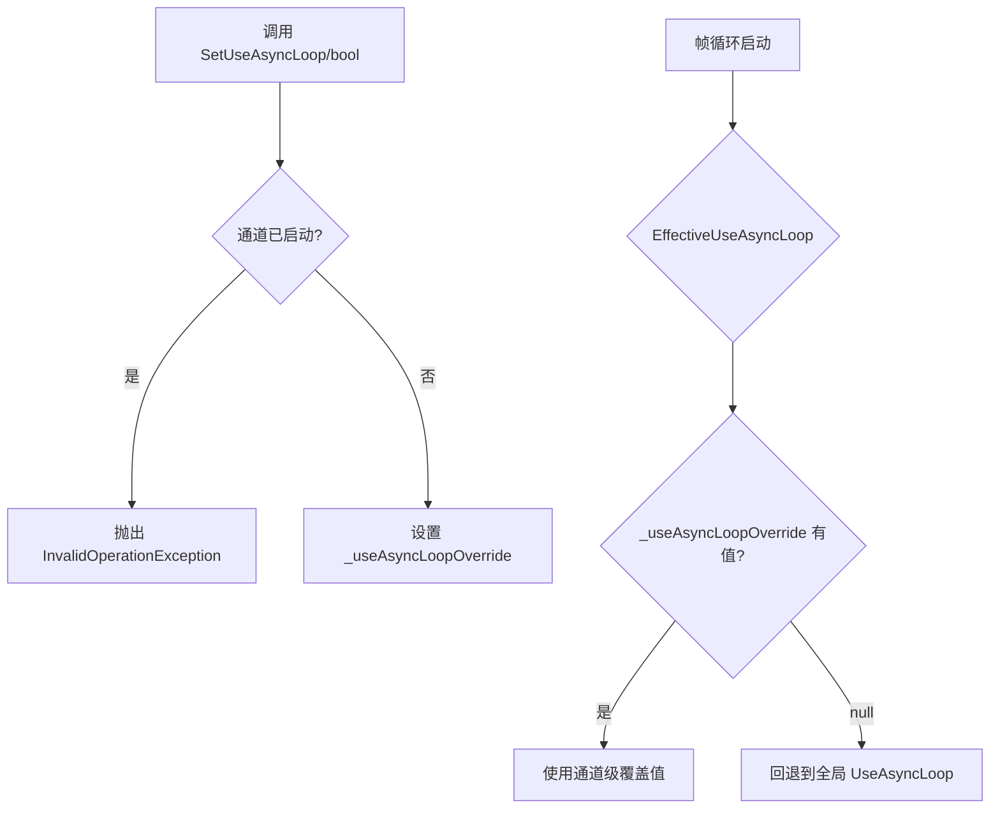

# 通道级 AsyncLoop 覆盖机制

> **涉及文件：** `Src/Core/VeloxDev.Core/TimeLine/MonoBehaviourManager.cs`
> **变更量：** +49 / -3 行

---

## 背景

此前 `MonoBehaviourManager` 只有一个全局静态属性 `UseAsyncLoop` 控制**所有通道**的帧循环模式。如果需要对某个特定通道使用 async/await 而其他通道继续使用原生 Thread，无法实现。

## 改进设计

引入**按通道独立覆盖**的机制，新增一个可空字段作为覆盖值，为 `null` 时回退到全局设置。

### 新增字段

```csharp
private bool? _useAsyncLoopOverride;
```

### 新增计算属性

```csharp
private bool EffectiveUseAsyncLoop => _useAsyncLoopOverride ?? MonoBehaviourManager.UseAsyncLoop;
```

所有帧循环启动点的判断从 `MonoBehaviourManager.UseAsyncLoop` 改为 `EffectiveUseAsyncLoop`。

### 实例方法（Channel 级别）

```csharp
/// <summary>
/// 设置当前通道是否使用 async/await 替代原生 Thread 驱动帧循环。
/// </summary>
/// <exception cref="InvalidOperationException">通道已启动时调用会抛出异常。</exception>
public void SetUseAsyncLoop(bool useAsyncLoop);

/// <summary>
/// 清除当前通道的独立覆盖配置，回退到全局 UseAsyncLoop。
/// </summary>
/// <exception cref="InvalidOperationException">通道已启动时调用会抛出异常。</exception>
public void ClearUseAsyncLoopOverride();
```

### 静态 API（委托到通道）

```csharp
// 按通道名称设置
public static void SetUseAsyncLoop(bool useAsyncLoop, string channel = DEFAULT_CHANNEL);

// 按通道名称清除
public static void ClearUseAsyncLoopOverride(string channel = DEFAULT_CHANNEL);
```

---

## 调用流程



---

## 设计要点

- **通道隔离**：每个 `Channel` 实例独立维护自己的 `_useAsyncLoopOverride`
- **安全守卫**：通道运行期间禁止修改覆盖值，防止帧循环中途切换驱动模式
- **透明回退**：`null` 表示"未覆盖"，自动使用全局 `UseAsyncLoop`
- **停止后可修改**：通道停止后可自由修改覆盖值，重新启动时生效

---

## 相关测试

新增完整的单元测试覆盖：

| 测试类别                  | 测试用例                                                                                                                      | 说明                     |
| ------------------------- | ----------------------------------------------------------------------------------------------------------------------------- | ------------------------ |
| SetUseAsyncLoop           | [查看测试详情](https://github.com/Axvser/VeloxDev/blob/master/Src/Core/VeloxDev.Core.Test/TimeLine/MonoBehaviourManagerTests.cs) | 启动前/后/停止后设置覆盖 |
| ClearUseAsyncLoopOverride | 同上                                                                                                                          | 清除覆盖的各种场景       |
| 通道隔离                  | 同上                                                                                                                          | 不同通道互不影响         |

> 测试文件：`Src/Core/VeloxDev.Core.Test/TimeLine/MonoBehaviourManagerTests.cs`（新增，未跟踪）

---

## 回退指南

如果希望保持 v5.4.0 的全局行为，无需任何改动——所有通道默认回退到 `MonoBehaviourManager.UseAsyncLoop`。