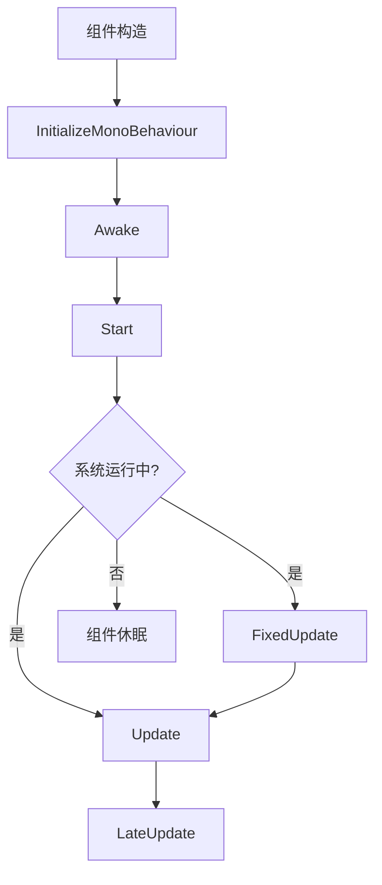

# VeloxDev MonoBehaviour

多线程组件生命周期管理

## 🚀 快速开始

### 基本用法

```csharp
[MonoBehaviour]
public partial class MainWindow : Window
{
    public MainWindow()
    {
        InitializeComponent();
        Loaded += (s, e) =>
        {
            InitializeMonoBehaviour();  // 每个组件实例初始化
            MonoBehaviourManager.Start();  // 全局启动一次
        };
    }

    partial void Awake()
    {
        Debug.WriteLine("🎯 组件唤醒 - 初始化逻辑");
    }

    partial void Start()
    {
        Debug.WriteLine("🚀 组件启动 - 准备就绪");
    }

    partial void Update(FrameEventArgs e)
    {
        // 每帧更新逻辑 - 受帧率影响
        Debug.WriteLine($"📊 帧更新 - DeltaTime: {e.DeltaTime}ms, FPS: {e.CurrentFPS}");
    }

    partial void FixedUpdate(FrameEventArgs e)
    {
        // 固定更新逻辑 - 不受帧率波动影响
        Debug.WriteLine("⚡ 物理更新 - 确定性计算");
    }
}
```

## 📚 核心 API

### 系统控制

```csharp
// 启动系统
MonoBehaviourManager.Start();

// 暂停/恢复
MonoBehaviourManager.Pause();
MonoBehaviourManager.Resume();
MonoBehaviourManager.TogglePause();

// 停止系统
MonoBehaviourManager.Stop();

// 重启系统
MonoBehaviourManager.Restart();
```

### 性能配置

```csharp
// 帧率控制
MonoBehaviourManager.SetTargetFPS(144);        // 144Hz 高刷新率
MonoBehaviourManager.SetTargetFPS(60);         // 60Hz 标准模式

// 物理更新频率
MonoBehaviourManager.SetFixedUpdateInterval(16); // 60Hz 物理更新
MonoBehaviourManager.SetFixedUpdateInterval(33); // 30Hz 物理更新

// 时间缩放（慢动作/快进）
MonoBehaviourManager.SetTimeScale(0.5f);       // 50% 速度 - 慢动作
MonoBehaviourManager.SetTimeScale(2.0f);        // 200% 速度 - 快进
MonoBehaviourManager.SetTimeScale(0f);         // 暂停 - 时间停止
```

### 状态监控

```csharp
// 系统状态
if (MonoBehaviourManager.IsRunning)
{
    var status = MonoBehaviourManager.SystemStatus; // "Running", "Paused", "Stopped"
    
    Debug.WriteLine($"🎮 系统状态: {status}");
    Debug.WriteLine($"📊 当前帧率: {MonoBehaviourManager.CurrentFPS}FPS");
    Debug.WriteLine($"⏱️ 运行时间: {MonoBehaviourManager.TotalTimeMs}ms");
    Debug.WriteLine($"🔄 总帧数: {MonoBehaviourManager.TotalFrames}");
    Debug.WriteLine($"👥 活跃组件: {MonoBehaviourManager.ActiveBehaviorCount}个");
}

// 线程状态监控
Debug.WriteLine($"🧵 Update线程: {(MonoBehaviourManager.IsUpdateThreadAlive ? "✅ 运行中" : "❌ 已停止")}");
Debug.WriteLine($"⚡ FixedUpdate线程: {(MonoBehaviourManager.IsFixedUpdateThreadAlive ? "✅ 运行中" : "❌ 已停止")}");
```

## 🏗️ 系统架构

### 双线程

```
┌─────────────────┐    ┌──────────────────┐
│   Update线程     │    │  FixedUpdate线程  │
│                 │    │                  │
│  • UI更新        │◄───┤  • 物理计算       │
│  • 游戏逻辑       │    │  • 碰撞检测       │
│  • 输入处理       │    │  • 确定性模拟     │
│  • 渲染准备       │    │                  │
└─────────────────┘    └──────────────────┘
         │                       │
         └─────► 主线程队列 ◄──────┘
```

### 生命周期

