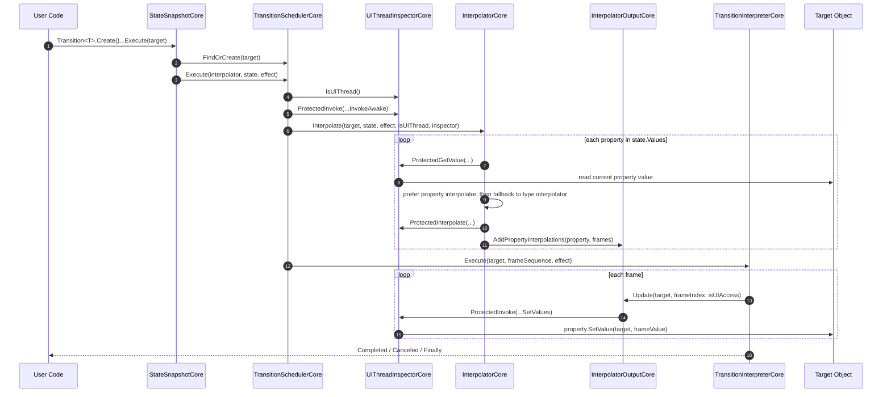

# VeloxDev TransitionSystem

[← 返回主页](../../README.md)

`VeloxDev.Core` 不是“某个平台的动画控件库”，而是一套**平台无关的状态插值执行架构**。  
各平台适配层（`MAUI / WinUI / Avalonia / WPF / WinForms`）做的事，本质上只是把这套核心抽象接到各自的 UI 线程模型、属性系统和平台类型上。

如果你读完本文，应当能够：

1. 理解 `VeloxDev.Core` 的动画执行架构
2. 会使用现成适配层编写动画
3. 能基于核心库自行实现一个新的平台适配层

---

## 1. 核心理念：动画不是“过程”，而是“状态流”

在 VeloxDev 里，动画可以理解为：

`目标对象当前状态` → `目标状态` → `插值帧序列` → `按时间调度写回目标对象`

所以它的关键抽象不是 Storyboard，也不是 Timeline 控件，而是这几个核心概念：

- `ITransitionProperty`：我要改哪个属性
- `IFrameState`：目标状态是什么
- `IValueInterpolator` / `InterpolatorCore`：如何把起点值插值成一组中间帧
- `IFrameSequence` / `InterpolatorOutputCore`：帧序列如何保存并写回对象
- `ITransitionEffectCore`：时长、FPS、缓动、循环等执行参数
- `IUIThreadInspectorCore`：如何安全切换 UI 线程
- `TransitionSchedulerCore`：如何调度一次动画任务
- `TransitionInterpreterCore`：如何按帧播放

一句话概括：

> **VeloxDev.Core 负责“动画的抽象执行模型”，适配层负责“平台对象怎么读、怎么算、怎么写、怎么切线程”。**

---

## 2. 从 `VeloxDev.Core` 看整套架构

### 2.1 `ITransitionProperty`：把表达式变成“属性路径”

核心类型：`ITransitionProperty`、`TransitionProperty`

职责：

- 保存属性路径 `Path`
- 保存最终属性类型 `PropertyType`
- 支持 `GetValue(target)`
- 支持 `SetValue(target, value)`

这层的意义非常大，因为它让框架支持：

- 普通属性：`x => x.Opacity`
- 嵌套属性：`x => x.Parent.BackColor`
- 深层属性：`x => ((TranslateTransform)x.RenderTransform).X`

也就是说，动画目标不是只能落在“对象自身的一级属性”，而是可以落在**一条属性链的末端**。

---

### 2.2 `IFrameState` / `StateCore`：描述“我要去到哪里”

核心类型：`IFrameState`、`StateCore`

它本质上就是两个字典：

- `Values`：`ITransitionProperty -> 目标值`
- `Interpolators`：`ITransitionProperty -> 指定插值器（可选覆盖默认插值器）`

所以一段动画其实就是“对若干属性，分别指定目标值”。例如：

```csharp
state.SetValue(x => x.TranslationX, 200d);
state.SetValue(x => x.Scale, 1.2d);
state.SetValue(x => ((LinearGradientBrush)x.Fill!).StartPoint, new Point(0, 1));
```

`StateCore` 不关心平台线程，也不关心如何播放；它只关心：

> “这一帧段想把哪些属性改成什么值。”

---

### 2.3 `InterpolatorCore`：把“起点值 + 终点值”变成帧序列

核心类型：`IValueInterpolator`、`InterpolatorCore`

执行时，框架会遍历 `IFrameState.Values`：

1. 从目标对象读取当前值
2. 取出状态中的目标值
3. 根据属性类型找插值器
4. 计算出一组帧：`List<object?>`
5. 塞进 `IFrameSequence`

`InterpolatorCore` 已经内置了大量基础类型插值器，例如：

- `double`
- `float`
- `Point`
- `Size`
- `Color`
- `Rectangle`
- `Vector2 / Vector3 / Quaternion`（条件编译环境下）

平台适配层要做的，就是继续注册自己的平台类型：

- `Brush`
- `Transform`
- `Projection`
- `Thickness`
- `CornerRadius`
- `Shadow`

---

### 2.4 `InterpolatorOutputCore` / `IFrameSequence`：保存插值结果，并把每一帧写回对象

核心类型：`IFrameSequenceCore`、`InterpolatorOutputCore`

它内部维护：

- `Frames : Dictionary<ITransitionProperty, List<object?>>`
- `Count : int`

当解释器播放到某一帧时，会调用：

```csharp
frameSequence.Update(target, frameIndex, isUIAccess, priority);
```

最终落到：

```csharp
property.SetValue(target, frameValue);
```

所以这层的角色是：

> **把插值结果缓存成“属性 -> 多帧值”，并在正确线程上把第 N 帧写回目标对象。**

---

### 2.5 `TransitionEffectCore`：描述“怎么走”

核心类型：`ITransitionEffectCore`、`TransitionEffectCore`

它定义了一段动画的执行参数：

| 属性 | 作用 |
|---|---|
| `Duration` | 持续时间 |
| `FPS` | 帧率 |
| `Ease` | 缓动函数 |
| `LoopTime` | 循环次数 |
| `IsAutoReverse` | 是否自动反向 |

同时还提供生命周期事件：

- `Awaked`
- `Start`
- `Update`
- `LateUpdate`
- `Canceled`
- `Completed`
- `Finally`

如果平台需要调度优先级，可以用：

```csharp
TransitionEffectCore<TPriorityCore>
```

例如 `WinUI` 适配层就是：

```csharp
public class TransitionEffect : TransitionEffectCore<DispatcherQueuePriority>
```

---

### 2.6 `UIThreadInspectorCore`：核心库与平台线程模型的边界

核心类型：`IUIThreadInspectorCore`、`UIThreadInspectorCore`

这是整套架构最关键的适配点之一。核心库不直接依赖任何平台 Dispatcher，而是把线程相关能力抽象成 4 件事：

- `IsAppAlive()`：应用是否还活着
- `IsUIThread()`：当前是否已经在 UI 线程
- `ProtectedGetValue(...)`：跨线程安全读取属性
- `ProtectedInterpolate(...)`：必要时在 UI 线程做插值
- `ProtectedInvoke(...)`：把帧更新切回 UI 线程执行

也就是说：

> `VeloxDev.Core` 不知道什么是 `DispatcherQueue`、`Dispatcher`、`MainThread`，它只知道“这里需要你帮我安全地读 / 算 / 写”。

---

### 2.7 `TransitionSchedulerCore`：一次动画任务的调度入口

核心类型：`TransitionSchedulerCore`

它的职责是：

1. 绑定目标对象
2. 管理取消令牌
3. 调用 `effect.InvokeAwake(...)`
4. 调用 `Interpolator` 生成帧
5. 调用 `TransitionInterpreter` 播放帧

同时它还处理 VeloxDev 的并行策略：

- `CanMutualTask = true`：同一对象默认只保留一个互斥动画，新动画会打断旧动画
- `CanMutualTask = false`：允许并存任务，框架会额外跟踪这类调度器

---

### 2.8 `TransitionInterpreterCore`：真正按时间逐帧执行

核心类型：`TransitionInterpreterCore`

解释器负责：

1. 根据 `Ease` 把线性帧索引映射成缓动帧索引
2. 计算每帧间隔 `span`
3. 循环遍历所有帧
4. 触发 `Update / LateUpdate`
5. 调用 `frameSequence.Update(...)`
6. 根据 `LoopTime` / `IsAutoReverse` 继续播放或反向播放

换句话说：

> 调度器负责“启动”，解释器负责“播放”。

---

### 2.9 `StateSnapshotCore` / `TransitionCore`：给最终用户的 Fluent API 外观

用户平时写的其实不是 `StateCore`，而是：

```csharp
Transition<T>.Create()
    .Property(...)
    .Effect(...)
    .AwaitThen(...)
    .Property(...)
    .Execute(target);
```

这层底下实际是一个**链表式状态段**：

- 当前段有自己的 `state`
- 当前段有自己的 `effect`
- 当前段有自己的 `interpolator`
- `AwaitThen(...)` 会把下一段串起来

所以一条 Fluent 链，本质上是“多段状态动画脚本”。

---

## 3. 执行时序图

下面这张图就是当前最新架构下一次 `Execute(target)` 的实际路径：



---

## 4. 现成适配层是怎么把核心库接到平台上的

以当前仓库中的适配层为例，每个平台大体都要提供下面这些类型：

| 层 | 典型实现 | 作用 |
|---|---|---|
| 状态层 | `State : StateCore` | 通常直接继承即可 |
| 效果层 | `TransitionEffect : TransitionEffectCore` / `TransitionEffectCore<TPriority>` | 平台是否需要优先级 |
| 插值器 | `Interpolator : InterpolatorCore<...>` | 注册平台专属可插值类型 |
| 帧输出 | `InterpolatorOutput : InterpolatorOutputCore<...>` | 让帧更新走平台 UI 线程 |
| UI线程检查器 | `UIThreadInspector : UIThreadInspectorCore...` | 封装 Dispatcher / MainThread |
| 解释器 | `TransitionInterpreter : TransitionInterpreterCore...` | 通常直接继承即可 |
| Fluent 外观 | `Transition<T>.StateSnapshot` | 提供平台友好的 `.Property(...)` 重载 |
| 快照扩展 | `Snapshot / SnapshotExcept` | 从平台对象提取当前状态 |

当前仓库已经包含：

- `VeloxDev.Avalonia`
- `VeloxDev.WPF`
- `VeloxDev.WinUI`
- `VeloxDev.MAUI`
- `VeloxDev.WinForms`

---

## 5. 先学会用：基于适配层编写动画

这一层是最终用户最常写的代码。

### 5.1 创建一段基础动画

```csharp
var animation = Transition<Rectangle>.Create()
    .Property(x => x.TranslationX, 240)
    .Property(x => x.Scale, 1.2)
    .Effect(e =>
    {
        e.Duration = TimeSpan.FromSeconds(1.2);
        e.Ease = Eases.Sine.InOut;
        e.FPS = 60;
    });

animation.Execute(myRect);
```

### 5.2 组合多段动画

```csharp
Transition<Rectangle>.Create()
    .Property(x => x.TranslationX, 200)
    .Effect(e =>
    {
        e.Duration = TimeSpan.FromSeconds(1);
        e.IsAutoReverse = true;
        e.LoopTime = 1;
    })
    .AwaitThen(TimeSpan.FromMilliseconds(300))
    .Property(x => x.Opacity, 0.2)
    .Effect(e =>
    {
        e.Duration = TimeSpan.FromSeconds(0.6);
        e.Ease = Eases.Cubic.Out;
    })
    .Execute(myRect);
```

### 5.3 记录快照并重置

```csharp
var snapshot = myRect.Snapshot(x => x.TranslationX, x => x.Scale, x => x.Fill);

Transition<Rectangle>.Create()
    .Property(x => x.TranslationX, 300)
    .Property(x => x.Scale, 1.4)
    .Execute(myRect);

snapshot.Effect(TransitionEffects.Empty).Execute(myRect);
```

### 5.4 嵌套属性动画

这是当前架构一个重要能力：

```csharp
Transition<Rectangle>.Create()
    .Property(x => ((TranslateTransform)x.RenderTransform).X, 400)
    .Effect(e => e.Duration = TimeSpan.FromSeconds(1))
    .Execute(myRect);
```

或：

```csharp
Transition<Rectangle>.Create()
    .Property(x => ((LinearGradientBrush)x.Fill!).StartPoint, new Point(0, 1))
    .Property(x => ((LinearGradientBrush)x.Fill!).EndPoint, new Point(1, 1))
    .Effect(e => e.Duration = TimeSpan.FromSeconds(1))
    .Execute(myRect);
```

这类表达式最终都会被核心层解析为一条 `TransitionProperty` 路径。

### 5.5 终止动画

```csharp
Transition.Exit(myRect);

Transition.Exit(
    myRect,
    IncludeMutual: true,
    IncludeNoMutual: true);
```

### 5.6 旋转方向控制：`RotationDirection`

对于以 `Transform` / `Projection` 为主的平台（WPF、Avalonia、WinUI），旋转插值默认取"最短路径"。  
如果你需要强制顺时针或逆时针方向，可以通过 `Property(...)` 的 `interpolationOptions` 参数传入 `RotationDirection` 枚举值。

```csharp
// 强制逆时针旋转（适用于二维 RotateTransform）
Transition<Rectangle>.Create()
    .Property(x => x.RenderTransform, [new RotateTransform(180)], RotationDirection.CounterClockWise)
    .Effect(e => e.Duration = TimeSpan.FromSeconds(1))
    .Execute(myRect);

// 组合三维旋转并指定逆时针方向
Transition<Rectangle>.Create()
    .Property(x => x.RenderTransform,
    [
        new TranslateTransform(200, 0),
        new Rotate3DTransform(180, 180, 0, 0, 0, 0, 0),
        new ScaleTransform(1.3, 1.3)
    ], RotationDirection.CounterClockWise)
    .Effect(e => e.Duration = TimeSpan.FromSeconds(1))
    .Execute(myRect);

// WinUI：Projection 旋转方向控制
Transition<Rectangle>.Create()
    .Property(x => x.Projection, new PlaneProjection { RotationX = 180, RotationY = 180 },
        RotationDirection.CounterClockWise)
    .Effect(e => e.Duration = TimeSpan.FromSeconds(1))
    .Execute(myRect);
```

`RotationDirection` 是一个 `[Flags]` 枚举，各成员可按位组合：

| 成员 | 值 | 含义 |
|---|---|---|
| `Auto` | `0` | 自动选择最短路径（默认行为） |
| `ClockWise` | `1 << 0` | 强制顺时针（适用于二维旋转或不区分轴的三维旋转） |
| `CounterClockWise` | `1 << 1` | 强制逆时针（适用于二维旋转或不区分轴的三维旋转） |
| `ClockWiseX` | `1 << 2` | 强制 X 轴顺时针 |
| `CounterClockWiseX` | `1 << 3` | 强制 X 轴逆时针 |
| `ClockWiseY` | `1 << 4` | 强制 Y 轴顺时针 |
| `CounterClockWiseY` | `1 << 5` | 强制 Y 轴逆时针 |
| `ClockWiseZ` | `1 << 6` | 强制 Z 轴顺时针 |
| `CounterClockWiseZ` | `1 << 7` | 强制 Z 轴逆时针 |

多轴独立控制示例：

```csharp
// X 轴逆时针 + Y 轴顺时针
RotationDirection.CounterClockWiseX | RotationDirection.ClockWiseY
```

> **注意**：`RotationDirection` 只对平台适配层中实现了方向感知的插值器生效（如 `TransformInterpolator`、`ProjectionInterpolator`）。  
> 对 MAUI 等直接暴露标量旋转属性（`Rotation`、`RotationX`、`RotationY`）的平台，方向控制请直接调整目标值的正负号，无需使用此枚举。

---

## 6. 使用层必须知道的几个规则

### 6.1 `Snapshot(...)` / `SnapshotAll()` 不是“录录像”，而是“拍当前状态”

它们都只记录调用当下的属性值，不会自动追踪后续变化。

- `Snapshot(...)`：只记录你显式指定的属性路径
- `SnapshotAll()`：自动发现并记录当前对象中可动画的属性
- `SnapshotExcept(...)`：自动发现并记录可动画属性，但排除指定路径及其子路径

### 6.2 引用类型重置时，必要时请重建对象

像 `Brush`、`Transform`、`Shadow` 这样的引用类型，有时会在动画过程中被原地修改。  
如果你发现“重置没有回到最初效果”，最稳妥的做法是：

- 要么拍叶子属性快照
- 要么重置时重新创建一个新的引用对象

例如：

```csharp
Transition<Rectangle>.Create()
    .Property(x => x.Fill, CreateBrush())
    .Effect(TransitionEffects.Empty)
    .Execute(myRect);
```

### 6.3 表达式必须最终落到可读可写属性

支持：

- `x => x.Opacity`
- `x => x.Parent.BackColor`
- `x => ((TranslateTransform)x.RenderTransform).X`

不支持：

- 字段
- 索引器
- 方法调用结果
- 最终不可写的属性链

### 6.4 能不能自动发现并动画，取决于“有没有插值器”

核心层不是靠“反射万能变化”来做动画，而是靠**类型插值器**。  
如果某个属性类型没有注册插值器，也不实现 `IInterpolable`，它就不会被自动发现为“可动画属性”。  
但你仍然可以通过显式路径 + 属性级插值器的方式把它纳入动画。

---

## 7. 如何自己做一个新的适配层

这一节是本文最重要的部分。  
如果你想支持一个新平台（比如 Uno、Skia UI、自研 UI 框架），你要做的不是重写动画系统，而是把新平台接到 `VeloxDev.Core`。

### 7.1 先决定：你的平台是否需要“调度优先级”

#### 不需要优先级

适合：MAUI、WinForms 这类只需要“回到 UI 线程”即可的平台。

你会使用：

- `UIThreadInspectorCore`
- `InterpolatorCore<TOutput>`
- `InterpolatorOutputCore<TUIThreadInspector>`
- `TransitionInterpreterCore<TOutput, TEffect>`
- `StateSnapshotCore<T,...>`（无 `TPriorityCore` 版本）

#### 需要优先级

适合：WPF、Avalonia、WinUI 这类 Dispatcher / Queue 自带优先级的平台。

你会使用：

- `UIThreadInspectorCore<TPriority>`
- `InterpolatorCore<TOutput, TPriority>`
- `InterpolatorOutputCore<TUIThreadInspector, TPriority>`
- `TransitionInterpreterCore<TOutput, TEffect, TPriority>`
- `TransitionEffectCore<TPriority>`
- `StateSnapshotCore<T,...,TPriority>`

---

### 7.2 最小适配层清单

#### 1）状态类

```csharp
public class State : StateCore
{
}
```

#### 2）效果类

无优先级版本：

```csharp
public class TransitionEffect : TransitionEffectCore
{
}
```

有优先级版本：

```csharp
public class TransitionEffect : TransitionEffectCore<MyPriority>
{
    public override MyPriority Priority { get; set; } = MyPriority.Normal;
}
```

#### 3）UI 线程检查器

无优先级版本：

```csharp
public class UIThreadInspector : UIThreadInspectorCore
{
    public override bool IsAppAlive() => true;
    public override bool IsUIThread() => /* 平台判断 */;

    public override object? ProtectedGetValue(bool isUIThread, object target, ITransitionProperty property)
    {
        if (isUIThread) return property.GetValue(target);
        return /* 切回 UI 线程并同步返回 */;
    }

    public override List<object?> ProtectedInterpolate(bool isUIThread, Func<List<object?>> interpolate)
    {
        if (isUIThread) return interpolate();
        return /* 切回 UI 线程并同步返回 */;
    }

    public override void ProtectedInvoke(bool isUIThread, Action action)
    {
        if (isUIThread)
        {
            action();
            return;
        }

        /* 切回 UI 线程并等待 action 真正执行完成 */
    }
}
```

> 注意：`ProtectedInvoke` 最好保证“调度成功且执行完成后再返回”，否则帧更新可能出现积压或乱序。

#### 4）插值器

```csharp
public class Interpolator : InterpolatorCore<InterpolatorOutput>
{
    static Interpolator()
    {
        RegisterInterpolator(typeof(Brush), new BrushInterpolator());
        RegisterInterpolator(typeof(Transform), new TransformInterpolator());
        RegisterInterpolator(typeof(Thickness), new ThicknessInterpolator());
        // 继续注册你的平台类型...
    }
}
```

#### 5）帧输出

```csharp
public class InterpolatorOutput : InterpolatorOutputCore<UIThreadInspector>
{
}
```

#### 6）解释器

```csharp
public class TransitionInterpreter : TransitionInterpreterCore<InterpolatorOutput, TransitionEffect>
{
}
```

#### 7）对外 `Transition<T>` 外观

```csharp
public class Transition<T> : TransitionCore<T, Transition<T>.StateSnapshot>
{
    public class StateSnapshot : StateSnapshotCore<
        T,
        State,
        TransitionEffect,
        Interpolator,
        UIThreadInspector,
        TransitionInterpreter>
    {
        public StateSnapshot Effect(Action<TransitionEffect> effectSetter)
            => CoreEffect<StateSnapshot, TransitionEffect>(effectSetter);

        public StateSnapshot Effect(TransitionEffect effect)
            => CoreEffect<StateSnapshot, TransitionEffect>(effect);

        public StateSnapshot Property(Expression<Func<T, double>> property, double value)
        {
            state.SetValue(property, value);
            return this;
        }

        public StateSnapshot Property(Expression<Func<T, Brush?>> property, Brush? value)
        {
            state.SetValue(property, value);
            return this;
        }

        // 继续补你平台常用类型的 Property 重载
    }
}
```

#### 8）`Snapshot` / `SnapshotAll` / `SnapshotExcept` 扩展

这是适配层易被忽略、但非常重要的一步。  
它决定你的平台用户能不能方便地“拍当前状态”。

至少要提供：

- `obj.Snapshot(x => x.Prop1, x => x.Prop2)`
- `obj.SnapshotAll()`
- `obj.SnapshotExcept(...)`

实现时建议复用：

- `TransitionSnapshotHelper`
- `TransitionProperty.TryCreate(...)`

其中 `SnapshotAll()` / `SnapshotExcept(...)` 应基于适配层已注册的插值器自动发现可动画属性；
而 `Snapshot(...)` 则保留为显式路径快照入口。

---

### 7.3 自定义适配层开发顺序建议

建议严格按下面顺序做：

1. 先写 `UIThreadInspector`
2. 再写 `Interpolator` 并注册基础平台类型
3. 再写 `Transition<T>.StateSnapshot` 的 `.Property(...)` 重载
4. 再写 `Snapshot` / `SnapshotExcept`
5. 最后做 Demo 验证：
   - 标量属性（`double`）
   - 引用类型属性（`Brush` / `Transform`）
   - 嵌套属性路径
   - 非 UI 线程触发动画
   - Reset / Exit

---

## 8. 推荐阅读顺序

如果你要深入源码，建议按这个顺序看：

1. `TransitionProperty`
2. `StateCore`
3. `InterpolatorCore`
4. `InterpolatorOutputCore`
5. `TransitionEffectCore`
6. `TransitionSchedulerCore`
7. `TransitionInterpreterCore`
8. 某一个具体平台适配层（推荐先看 `WPF` 或 `Avalonia`）

---

## 9. 总结

- `VeloxDev.Core` 解决的是：**动画怎么抽象、怎么插值、怎么调度、怎么播放**
- 平台适配层解决的是：**属性怎么读写、哪些类型可插值、UI 线程怎么切换**
- 用户日常只需要写：**`Transition<T>.Create() -> Property(...) -> Effect(...) -> Execute(...)`**
- 框架作者 / 适配层作者则要理解：**`State + Interpolator + Output + Inspector + Interpreter + Snapshot API`**
