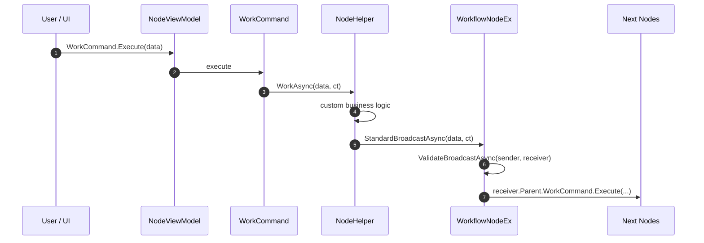

# VeloxDev Workflow System

`VeloxDev.Core.WorkflowSystem` 是一套**面向图结构组件的工作流内核**。  
它不关注平台 UI 兼容层，而关注：

- 工作流组件模型如何组织
- 组件之间如何连线、传播、回溯
- 业务逻辑如何通过 `Helper` 注入
- `Undo / Redo / Command / Source Generator` 如何协同

如果你读完本文，应当能够：

1. 理解当前 `Workflow` 的核心架构
2. 会使用 `Tree / Node / Slot / Link + Helper` 编写工作流
3. 理解源生成器为工作流组件补了哪些基础设施

---

## 1. 核心理念：工作流 = 图结构组件 + Helper 驱动业务

在当前架构里，一个工作流不是“某种流程脚本对象”，而是一张由组件组成的图：

- `Tree`：整个工作流容器
- `Node`：节点，代表处理单元或控制单元
- `Slot`：节点的输入/输出连接点
- `Link`：两个 `Slot` 之间的可视连接

这四类组件都遵循同一个原则：

> **组件只持有状态与命令，真正的行为逻辑放在 `Helper` 中。**

也就是说：

- `ViewModel` 负责暴露属性、命令、引用关系
- `Helper` 负责实现“创建、移动、删除、传播、校验、关闭”等行为
- 标准扩展 `StandardEx` 负责提供默认实现
- 源生成器负责自动补齐样板代码

---

## 2. 从核心接口看整体架构

### 2.1 `IWorkflowViewModel`：所有组件的共同根接口

所有工作流组件都继承自：

- `IWorkflowViewModel`

它定义了最基础的能力：

- `InitializeWorkflow()`
- `OnPropertyChanging(string)`
- `OnPropertyChanged(string)`
- `CloseCommand`

同时它还继承：

- `INotifyPropertyChanging`
- `INotifyPropertyChanged`

所以整个 `Workflow` 系统默认就是一个**带通知、带命令、可关闭**的 MVVM 图结构模型。

---

### 2.2 四类核心组件

#### `IWorkflowTreeViewModel`

职责：

- 持有整个工作流中的所有 `Node`
- 持有所有 `Link`
- 持有 `LinksMap`
- 管理连接预览用的 `VirtualLink`
- 提供 `Undo / Redo / Submit`

关键命令：

- `CreateNodeCommand`
- `SetPointerCommand`
- `SendConnectionCommand`
- `ReceiveConnectionCommand`
- `ResetVirtualLinkCommand`
- `SubmitCommand`
- `RedoCommand`
- `UndoCommand`

#### `IWorkflowNodeViewModel`

职责：

- 属于某个 `Tree`
- 持有自己的 `Anchor`、`Size`
- 持有一组 `Slots`
- 执行工作与广播传播

关键命令：

- `MoveCommand`
- `SetAnchorCommand`
- `SetSizeCommand`
- `CreateSlotCommand`
- `DeleteCommand`
- `WorkCommand`
- `BroadcastCommand`
- `ReverseBroadcastCommand`

#### `IWorkflowSlotViewModel`

职责：

- 属于某个 `Node`
- 记录 `Targets` / `Sources`
- 记录连接通道与状态
- 负责连线构建的输入/输出端角色

关键命令：

- `SetSizeCommand`
- `SetChannelCommand`
- `SendConnectionCommand`
- `ReceiveConnectionCommand`
- `DeleteCommand`

#### `IWorkflowLinkViewModel`

职责：

- 连接 `Sender` 和 `Receiver`
- 控制可视状态 `IsVisible`

关键命令：

- `DeleteCommand`

---

## 3. `Helper` 是工作流的业务注入点

每个组件类型都有对应 Helper 接口：

- `IWorkflowTreeViewModelHelper`
- `IWorkflowNodeViewModelHelper`
- `IWorkflowSlotViewModelHelper`
- `IWorkflowLinkViewModelHelper`

`Helper` 的作用不是“替代 ViewModel”，而是：

> **让默认组件模型保持稳定，把真实业务扩展点集中到可重写的行为对象上。**

例如 `Node` 的 Helper 接口现在包含：

- `Install(...)`
- `Uninstall(...)`
- `CreateSlot(...)`
- `Move(...)`
- `SetAnchor(...)`
- `SetLayer(...)`
- `SetSize(...)`
- `WorkAsync(...)`
- `BroadcastAsync(...)`
- `ReverseBroadcastAsync(...)`
- `ValidateBroadcastAsync(...)`
- `Delete()`

这意味着你可以：

- 自定义节点工作逻辑
- 自定义正向传播逻辑
- 自定义反向传播逻辑
- 自定义边校验逻辑

而不必重写整个节点模型。

---

## 4. 标准 Helper 与标准扩展的分工

当前核心库已经提供：

- `TreeHelper`
- `NodeHelper`
- `SlotHelper`
- `LinkHelper`

这些标准 Helper 会把默认行为委托到 `StandardEx` 扩展方法。

例如：

- `NodeHelper.BroadcastAsync(...)` → `component.StandardBroadcastAsync(...)`
- `NodeHelper.ReverseBroadcastAsync(...)` → `component.StandardReverseBroadcastAsync(...)`
- `NodeHelper.CreateSlot(...)` → `component.StandardCreateSlot(...)`
- `NodeHelper.Delete()` → `component.StandardDelete()`

所以当前架构可以理解为：

```text
ViewModel
  -> 持有 Helper
  -> 命令调用 Helper
  -> Helper 再调用 StandardEx 里的默认实现
```

这让你可以在两个层次上扩展：

1. **轻度扩展**：继承标准 Helper，只改业务逻辑
2. **深度扩展**：重写或替换 `StandardEx` 的默认策略

---

## 6. 源生成器在 Workflow 里做了什么

工作流系统的大量样板代码都不是手写的，而是通过：

- `WorkflowBuilder.ViewModel.Tree<THelper>`
- `WorkflowBuilder.ViewModel.Node<THelper>`
- `WorkflowBuilder.ViewModel.Slot<THelper>`
- `WorkflowBuilder.ViewModel.Link<THelper>`

这些特性触发源生成器自动补齐。

### 生成器负责补的内容

以 `Node` 为例，生成器会补：

- `Helper` 属性
- `Parent` / `Anchor` / `Size` / `Slots` 属性
- `BroadcastMode` / `ReverseBroadcastMode` 属性
- 命令包装：
  - `MoveCommand`
  - `SetAnchorCommand`
  - `SetSizeCommand`
  - `CreateSlotCommand`
  - `DeleteCommand`
  - `WorkCommand`
  - `BroadcastCommand`
  - `CloseCommand`
- 行为包装方法：
  - `Move(...)`
  - `SetAnchor(...)`
  - `SetSize(...)`
  - `CreateSlot(...)`
  - `Delete(...)`
  - `Work(...)`
  - `Broadcast(...)`
  - `Close(...)`
- `GetHelper()` / `SetHelper(...)` / `InitializeWorkflow()`
- 属性变更钩子：
  - `partial void OnXxxChanging(...)`
  - `partial void OnXxxChanged(...)`

### 继承支持

当前 `WorkflowWriter` 也已经支持：

- 基类生成完整 Workflow 基础设施
- 子类同类组件不重复生成整套成员
- 子类允许自动 `override Helper`

这意味着你可以安全做：

```csharp
[WorkflowBuilder.ViewModel.Node<BaseNodeHelper>]
public partial class BaseNode
{
}

[WorkflowBuilder.ViewModel.Node<SpecialNodeHelper>]
public partial class SpecialNode : BaseNode
{
}
```

此时子类重点替换的是 `Helper`，而不是重复生成整套节点基础设施。

---

## 6. 工作流执行时序图

下面是一条典型节点工作链：



如果是反向传播，则会沿 `Slot.Sources` 逆向回溯上游节点。

---

## 7. 当前最新传播模型

### 7.1 正向传播

正向传播入口：

- `helper.BroadcastAsync(parameter, ct)`
- `node.StandardBroadcastAsync(parameter, ct)`

正向传播会沿：

- `node.Slots[*].Targets[*]`

向下游节点扩散。

### 7.2 反向传播

反向传播入口：

- `helper.ReverseBroadcastAsync(parameter, ct)`
- `node.StandardReverseBroadcastAsync(parameter, ct)`

反向传播会沿：

- `node.Slots[*].Sources[*]`

回溯上游节点。

### 7.3 边校验

无论正向还是反向传播，都会经过：

- `ValidateBroadcastAsync(sender, receiver, parameter, ct)`

所以你可以把以下逻辑放进去：

- 权限检查
- 数据类型检查
- 节点状态检查
- 节流与过滤

---

## 8. 先学会用：最小工作流写法

### 8.1 定义组件

> 构造函数中应调用 `InitializeWorkflow()`

```csharp
[WorkflowBuilder.ViewModel.Tree<TreeHelper>]
public partial class MyTree
{
    public MyTree() => InitializeWorkflow();
}

[WorkflowBuilder.ViewModel.Node<NodeHelper>(workSemaphore: 3)]
public partial class MyNode
{
    public MyNode() => InitializeWorkflow();
}

[WorkflowBuilder.ViewModel.Slot<SlotHelper>]
public partial class MySlot
{
    public MySlot() => InitializeWorkflow();
}

[WorkflowBuilder.ViewModel.Link<LinkHelper>]
public partial class MyLink
{
    public MyLink() => InitializeWorkflow();
}
```

---

### 8.2 自定义 `NodeHelper`

```csharp
public class NodeHelper : NodeHelper
{
    public override async Task WorkAsync(object? parameter, CancellationToken ct)
    {
        await DoBusinessAsync(parameter, ct);

        // 默认正向传播
        await BroadcastAsync(parameter, ct);
    }

    public override async Task<bool> ValidateBroadcastAsync(
        IWorkflowSlotViewModel sender,
        IWorkflowSlotViewModel receiver,
        object? parameter,
        CancellationToken ct)
    {
        await Task.CompletedTask;
        return true;
    }
}
```

---

### 8.3 使用命令驱动交互

```csharp
node.MoveCommand.Execute(new Offset(10, 20));
node.WorkCommand.Execute(payload);

slot.SendConnectionCommand.Execute(null);
slot.ReceiveConnectionCommand.Execute(null);

tree.UndoCommand.Execute(null);
tree.RedoCommand.Execute(null);
```

---

## 9. `Tree / Node / Slot / Link` 的职责边界

### `Tree`

负责：

- 整体容器
- 节点/连接集合
- 历史记录与撤销重做
- 连接构建协调

### `Node`

负责：

- 表示一个工作单元
- 对外暴露工作与传播命令
- 持有 `Slots`

### `Slot`

负责：

- 表示节点的输入输出端
- 维护来源与去向
- 维护通道限制与连接状态

### `Link`

负责：

- 仅表示连接关系与显示状态

这种拆分的好处是：

> 传播逻辑不直接写在 `Link` 上，而是通过 `Node -> Slot -> Slot` 的关系完成图遍历。

---

## 10. 当前系统的几个关键特性

### 10.1 并发工作

`Node` 特性支持：

```csharp
[WorkflowBuilder.ViewModel.Node<NodeHelper>(workSemaphore: 5)]
```

这会影响生成出来的 `WorkCommand` 并发容量。

### 10.2 Undo / Redo

`Tree` 层通过：

- `Submit(IWorkflowActionPair)`
- `Undo()`
- `Redo()`

维护工作流结构变更历史。

像：

- 创建节点
- 建立连接
- 删除节点

都可以通过标准实现接入撤销重做。

### 10.3 布局与可视数据分离

当前核心里有一批专门的工作流空间/可视模型：

- `Anchor`
- `Offset`
- `Size`
- `VisualPoint`
- `Viewport`
- `SpatialGridHashMap`
- `CanvasLayout`

这让 `Workflow` 不只是逻辑图，也能承载布局和命中查询相关能力。

### 10.4 序列化

工作流通常会配合 `VeloxDev.Core.Extension` 的序列化扩展使用，例如：

```csharp
string json = tree.Serialize();
bool ok = json.TryDeSerialize(out MyTree? restored);
```

---

## 11. 推荐开发方式

建议按下面顺序开发自己的工作流：

1. 先定义 `Tree / Node / Slot / Link` 四类组件
2. 再为四类组件各自指定 `Helper`
3. 在 `NodeHelper.WorkAsync(...)` 中实现节点工作逻辑
4. 在 `ValidateBroadcastAsync(...)` 中补边校验
5. 再把 UI 的拖拽、连线、缩放等交互绑到命令上

---

## 12. 总结

- `Workflow` 的本体是一张由 `Tree / Node / Slot / Link` 组成的图
- `Helper` 负责注入行为，`StandardEx` 负责默认实现
- 源生成器负责补齐组件样板代码
- `Node` 可以做正向传播，也可以做反向传播
- 传播模式支持：`Parallel / BreadthFirst / DepthFirst`
